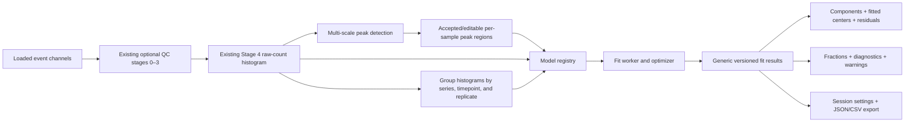

# PhaseFinder cell-cycle modeling implementation plan

> **Status:** implementation-ready plan
>
> **Audience:** the agent implementing the next modeling layer
>
> **Baseline:** the current `cell-cycle-modeling-sidebar` work, the existing
> Stage 0–4 QC/histogram pipeline, and the model handoff in
> `assets/misc/cell-cycle-modeling-handoff(2).zip`
>
> **Scope:** independent per-sample Dean–Jett, Dean–Jett–Fox, and Watson fits;
> joint CLOCCS fitting across related time-indexed sample histograms; automatic
> peak proposals; editable per-sample peak regions; model-neutral rendering,
> persistence, diagnostics, and export. Advanced contaminants, multiple ploidy,
> marker-assisted analysis, and production CLOCCS inference are sequenced after
> the core per-sample models.

This plan supersedes the Stage 5–8 scientific/modeling portion of
`docs/djf_impl_plan.md`. That older document remains useful history for the
nine-stage scaffold, but it intentionally ported the current simplified bridge
model and deferred equation fidelity.

## 1. Outcome and locked product decisions

PhaseFinder already has the expensive application plumbing that should be
preserved:

- optional structural, time, scatter, and singlet QC;
- a QC-filtered linear DNA histogram;
- multi-sample histogram plotting;
- per-sample runtime state and invalidation;
- model overlays, a results table, metadata-derived phase columns, and lazy
  loading; and
- the in-progress sidebar mode for cell-cycle modeling.

Do not rebuild those systems. Extend the Stage 4 histogram contract, retain QC,
and replace the Stage 5–8 scientific tail behind a model-neutral interface.

The basic modeling workflow will be:

1. Select the sample whose peak regions are being reviewed.
2. Inspect the raw histogram and the automatic G1/G2/M proposal.
3. Accept the proposal, choose an alternative, or edit four peak-region limits.
4. Select a model. For CLOCCS, also select/confirm the time-series group,
   numeric timepoints, and replicate mapping.
5. Fit the current sample or all reviewed samples independently for DJ, DJF,
   Auto, or Watson; fit the selected set of histograms jointly for CLOCCS.
6. Inspect components, fitted centers, residuals, fractions, diagnostics, and
   warnings.
7. Save the configuration or export a reproducible analysis artifact.

The four editable limits are **semantic peak regions**, not hard phase gates:

```text
G1 left |------ G1 peak ------| G1 right
G2 left |---- G2/M peak -----| G2 right
```

The optimizer may move each fitted center inside its assigned region. It must
never move the four limits, swap G1/G2 identity, or calculate percentages by
counting events between the limits. Percentages come from fitted component
areas.

### 1.1 Main model dropdown

Use these entries. Within the new feature-flagged workflow,
`auto_dj_djf` is the initial selection. The dropdown selects both a model and
its fit scope:

| ID | Label | Fit scope | Behavior |
|---|---|---|---|
| `auto_dj_djf` | **Automatic — Dean–Jett / Dean–Jett–Fox** | Per sample | Independently fit both generative models to each selected sample histogram from comparable starts. Retain Fox only when penalized likelihood, residual structure, nontrivial wave area, boundary checks, and restart stability support it. |
| `dean_jett` | **Dean–Jett** | Per sample | Independently fit the broadened latent quadratic S-phase model to each selected sample histogram. |
| `dean_jett_fox` | **Dean–Jett–Fox** | Per sample | Independently fit Dean–Jett plus a latent Gaussian S-phase wave, with the entire latent S distribution broadened afterward. Report “complex S-phase model”; do not infer synchronization. |
| `watson_pragmatic` | **Watson Pragmatic** | Per sample | Independently apply pragmatic peak fitting plus residual S decomposition. Label it separately and never rank it against DJ/DJF with ordinary AIC/BIC. |
| `cloccs_time_series` | **CLOCCS — Joint time series** | Joint series | Jointly fit a selected set of related sample histograms using numeric timepoint and replicate metadata. Share population-dynamics parameters across the series while producing an expected histogram for every sample/timepoint. Enable only when the selected samples form a valid synchronized time series. |

During development and the first opt-in rollout, the application-wide default
remains `legacy_bridge_v1`. Switch the application default to `auto_dj_djf`
only after the scientific validation gate in §11.5 is approved.

The following are deliberately not ordinary entries in that dropdown:

- `legacy_bridge_v1`: advanced compatibility/debug option for the current
  tapered bridge. It must no longer be labeled Dean–Jett–Fox.
- Debris, aggregate, and sub-G1-like signal: `Off / Auto / On` component
  policies below the model selector.
- Multiple ploidy: an advanced population-count option layered on a generative
  base model.
- Marker-assisted EdU/BrdU analysis: a later event-level multiparameter mode.

CLOCCS belongs in the same model dropdown because PhaseFinder already works
with multiple sample histograms. Its important distinction is not “one versus
many histograms”; it is **independent per-sample fitting versus one joint fit
across a time-indexed series**. Selecting CLOCCS changes the target and controls
from a sample/batch to a series group. Until M8 is complete, show it as disabled
with an explanation rather than routing it through a per-sample adapter.

### 1.2 Basic versus advanced controls

Basic controls:

- active histogram/sample for peak review;
- series group when a joint-series model is selected;
- model dropdown;
- automatic detection status and alternatives;
- G1-left, G1-right, G2/M-left, and G2/M-right;
- Reset to automatic;
- Accept peak regions when review is required;
- Fit/Refit current and Fit all reviewed samples for per-sample models; and
- Fit selected series for joint-series models.

Advanced controls:

- G2:G1 ratio mode: `free`, `bounded`, or `locked`;
- bounded range or locked value;
- G1/G2 CV mode: `free`, `equal`, or calibrated/locked;
- fit domain;
- metadata mappings for series ID, numeric timepoint, and replicate when a
  joint-series model is selected;
- contaminant policies;
- additional-ploidy population count; and
- developer-only optimizer and detector settings.

Initial versioned defaults:

```js
{
  modelId: "auto_dj_djf",
  detectionRatioRange: [1.60, 2.35],
  ratioMode: "bounded",
  fitRatioRange: [1.65, 2.25],
  lockedRatio: 2.0,
  cvMode: "free",
  contaminants: {
    debris: "off",
    aggregate: "off",
    subG1: "off",
  },
  ploidyCount: 1,
}
```

Detection uses a deliberately broader ratio range than fitting so plausible
alternatives are visible before constraints are applied.

## 2. Existing code to preserve and extend

| Existing area | Decision |
|---|---|
| `js/analysis/structural_qc.js` through `pulse_geometry_gate.js` | Keep. These remain optional preprocessing/QC inputs to the modeling histogram. |
| `js/analysis/dna_histogram.js` | Keep as the only event-to-histogram implementation. Add edges, underflow/overflow, identity, and revision fields. Do not port the archive’s duplicate event histogram builder. |
| `js/analysis/peak_detection.js` | Replace internally with a compatibility wrapper around the new multi-scale detector. |
| `js/analysis/legacy_bridge_fit.js` | Preserve only as the `legacy_bridge_v1` adapter while canonical models are validated. It must stop being the default scientific implementation. |
| `js/analysis/debris_aggregate_extension.js` | Preserve only for legacy comparisons. Replace its aggregate/debris equations before exposing extensions on canonical models. |
| `js/analysis/cell_cycle_fit_report.js` | Reuse useful diagnostics, but adapt reporting to the generic result and Poisson likelihood contracts. |
| `js/analysis/pipeline_state.js` | Keep QC/histogram state; add nested model-neutral modeling state and semantic invalidation helpers. |
| `js/analysis/pipeline_ui.js` | Keep QC-button behavior. Move user-facing model interactions to a new controller. Stage-number buttons may remain behind a developer disclosure. |
| `js/plotting/render.js` | Keep the histogram renderer. Generalize fit components and add the peak-region/residual overlays. |
| `js/plotting/modeling.js` | Generalize the table from DJF-specific fields to the shared fit result. |
| current `#sidebar_modeling_section` work | Keep. Replace its Stage 5–8 debug group with the user-facing controls in this plan after the current sidebar edits land. |

The implementation must not overwrite or revert the uncommitted sidebar work
that existed when this plan was written.

## 3. Target architecture



Add a model-neutral directory rather than putting new algorithms under a
DJF-specific name:

```text
js/analysis/cell_cycle/
├── modeling_ui.js
├── modeling_state.js
├── model_registry.js
├── model_config.js
├── fit_engine.js
├── fit_worker.js
├── diagnostics.js
├── model_selection.js
├── export.js
├── peak_detection.js
├── peak_initialization.js
├── peak_regions.js
├── math/
│   ├── gaussian_bin_mass.js
│   ├── quadrature.js
│   ├── poisson.js
│   └── transforms.js
└── models/
    ├── shared.js
    ├── dean_jett.js
    ├── dean_jett_fox.js
    ├── watson_pragmatic.js
    ├── cloccs_time_series.js
    ├── legacy_bridge.js
    └── extended.js

js/plotting/
├── peak_region_overlay.js
└── residual_plot.js
```

The archive is MIT-licensed. Preserve its license notice for substantial
ported code and note the source module in file headers.

## 4. Data and API contracts

### 4.1 Histogram

Augment `stage4.generateHistogram()` without breaking its existing aliases:

```js
{
  edges: number[],        // binCount + 1
  centers: number[],      // alias/current x
  counts: number[],       // alias/current y
  x: number[],
  y: number[],
  min: number,
  max: number,
  binWidth: number,
  binCount: number,
  underflow: number,
  overflow: number,
  retainedCount: number,
  binnedCount: number,
  totalEvents: number,
  dnaChannel: string,
  scale: "linear",
  revision: number,
  fingerprint: string,
}
```

The fingerprint must include the sample identity, DNA channel, event/QC
revision, bin count, and range. Add `ensure_histogram_current()` and rebuild
only when this fingerprint changes. Remove the current unconditional Stage 4
rerun before both Stages 5 and 6; that rerun currently deletes the Stage 5
result before fitting.

`render.js` already reconstructs bin edges from `min`, `binWidth`, and
`binCount`. Change it to consume `histogram.edges` while retaining the fallback
for old runtime state.

### 4.2 Per-sample modeling state

Use a plain serializable object nested in the existing per-sample pipeline
state. Key runtime state by `row.id` plus channel rather than filename alone;
retain `get_state(name)` only as a temporary compatibility lookup.

```js
modeling: {
  schemaVersion: 1,
  histogramFingerprint: null,
  fitDomain: null,

  peakDetection: {
    detectorId: "multiscale_v1",
    status: "detected", // detected | low_confidence | inferred_g2
    confidence: 0,
    reasons: [],
    candidates: [],
    pairs: [],
    selectedPairId: null,
    alternatives: [],
    configuration: {},
  },

  peakSelection: {
    automaticRegions: null,
    regions: null,
    source: "automatic", // automatic | alternative | manual
    reviewed: false,
    stale: false,
    revision: 0,
    initialCenters: null,
  },

  settings: {
    modelId: "auto_dj_djf",
    ratioMode: "bounded",
    ratioRange: [1.65, 2.25],
    lockedRatio: 2,
    cvMode: "free",
    contaminants: { debris: "off", aggregate: "off", subG1: "off" },
    ploidyCount: 1,
  },

  resultsByKey: {},
  modelComparison: null,
  activeResultKey: null,
  revision: 0,
}
```

Each result key combines model ID/version, histogram fingerprint, peak-region
revision, fit domain, and a canonical configuration hash. Switching the model
dropdown may activate a matching cached fit but must not rebuild the histogram,
rerun detection, move peak regions, or delete other model results.

Required public operations:

```js
ensure_model_histogram(row, options)
detect_peak_regions(row, options)
select_peak_pair(row, pairId)
update_peak_regions(row, regions, { source: "manual" })
accept_peak_regions(row)
reset_peak_regions(row)
set_model_settings(row, patch)
fit_cell_cycle_model(row, modelId, options)
fit_cell_cycle_models(rows, modelId, options)
fit_cell_cycle_series(series, modelId, options)
get_modeling_state(row)
get_series_modeling_state(seriesId)
```

### 4.3 Joint-series modeling state

Per-sample state remains the source of each histogram, QC provenance, peak
detection, and peak regions. Joint models additionally use a series-level
state keyed by an explicit series ID and configuration hash:

```js
seriesModeling: {
  schemaVersion: 1,
  seriesId: "condition-a",
  modelId: "cloccs_time_series",
  members: [
    {
      rowId: "sample-1",
      histogramFingerprint: "...",
      peakRegionRevision: 2,
      timepoint: 0,
      replicate: "r1",
    },
  ],
  sharedSettings: {},
  replicateSettings: {},
  resultsByKey: {},
  activeResultKey: null,
  revision: 0,
}
```

A series result is invalidated when membership, timepoint/replicate metadata,
any member histogram, accepted peak regions, or shared settings change.
Changing the active histogram used to review handles must not invalidate the
series.

### 4.4 Model registry

```js
{
  id: "dean_jett",
  version: "1.0.0",
  label: "Dean–Jett",
  kind: "generative", // generative | decomposition
  fitScope: "per_sample", // per_sample | joint_series
  comparisonGroup: "poisson_cell_cycle", // null for Watson
  requiredInputs: ["sample_histogram", "peak_regions"],
  capabilities: {
    contaminants: true,
    multiplePloidy: true,
    autoComparison: true,
  },
  defaultConfig,
  parameterSchema,
  initialize(context),
  fit(context),
  expectedCounts(edges, params),
  normalizeResult(rawResult),
}
```

`auto_dj_djf` is a selection policy over two registered generative models, not
a third biological equation. The CLOCCS adapter instead declares
`fitScope: "joint_series"` and requires a histogram set plus series ID,
numeric timepoint, and replicate metadata.

### 4.5 Generic fit result

```js
{
  schemaVersion: 1,
  modelId: "dean_jett",
  modelVersion: "1.0.0",
  modelLabel: "Dean–Jett",
  kind: "generative",
  fitScope: "per_sample",
  comparisonGroup: "poisson_cell_cycle",

  converged: true,
  convergenceReason: "relative_deviance_and_step",
  parameters: {},
  bounds: {},
  expectedCounts: number[],
  components: [
    {
      id: "g1",
      label: "G1 / 1C",
      role: "biological",
      counts: number[],
      totalArea: number,
      observedDomainArea: number,
      includeInBiologicalDenominator: true,
    },
  ],
  phaseFractions: { g1: 0, s: 0, g2: 0 },
  contaminantFractions: {},
  peakRegionMigration: {},
  diagnostics: {},
  warnings: [],
  provenance: {},

  // Joint-series models return one entry per input histogram. Per-sample
  // models may omit this or return a one-entry array.
  targetResults: [
    {
      rowId: "sample-1",
      timepoint: 0,
      replicate: "r1",
      expectedCounts: [],
      components: [],
      diagnostics: {},
    },
  ],
}
```

Rendering must iterate over component descriptors rather than assuming fixed
`fit.curves.g1/s/g2/debris/aggregate` properties. A temporary adapter can
produce the current shape during migration.

## 5. Mathematical and numerical specification

### 5.1 Observation model

Fit raw integer histogram counts. Smoothing is only for peak detection and
display.

For observed count `y_i` and expected bin count `lambda_i`:

\[
-\ell(\theta)=\sum_i\left[\lambda_i-y_i\log\lambda_i\right]
\]

ignoring constants independent of the parameters. Report log likelihood,
Poisson deviance, reduced Poisson deviance, Pearson residuals, deviance
residuals, lag-1 residual autocorrelation, runs statistic, parameter-boundary
hits, restart behavior, and tail mass outside the fitted domain.

Use the number of fitted bins as `n` for AICc/BIC. Do not mix weighted and raw
SSE criteria across selection and reporting.

Biological phase fractions use the model's total component areas:

\[
p_{G1}=\frac{N_{G1}}{N_{G1}+N_S+N_{G2}},\quad
p_S=\frac{N_S}{N_{G1}+N_S+N_{G2}},\quad
p_{G2}=\frac{N_{G2}}{N_{G1}+N_S+N_{G2}}.
\]

Also report the portion of every component falling inside the observed fit
domain. Warn when missing tail mass is large enough to make total-area fractions
sensitive to the chosen domain. Contaminants never enter the biological
denominator.

### 5.2 Integrated G1 and G2/M peaks

Use area parameters and integrate each Gaussian over each bin:

\[
G_{k,i}=N_k\left[
\Phi\left(\frac{b_{i+1}-\mu_k}{\sigma_k}\right)-
\Phi\left(\frac{b_i-\mu_k}{\sigma_k}\right)
\right],\qquad \sigma_k=CV_k\mu_k.
\]

G1 and G2/M means are direct parameters when ratio mode is free or bounded.
The ratio is derived for reporting. Equal-CV or locked-ratio behavior is an
explicit mode, never an invisible default.

### 5.3 Dean–Jett S phase

Let

\[
u(z)=\mu_1+z(\mu_2-\mu_1),\qquad z\in[0,1].
\]

Use a literal normalized quadratic:

\[
q(z)=a+bz+cz^2,\qquad
a=1-\frac b2-\frac c3,
\]

so `integral(q, 0..1) = 1`. Reject parameter values when the analytic minimum
of `q` on `[0,1]` is negative. This preserves the published quadratic class
without the archive’s softplus transformation and removes an unidentifiable
overall polynomial scale. Evaluate `q(0)`, `q(1)`, and the vertex
`z = -b / (2c)` when `c > 0` and the vertex lies inside `[0,1]`.

The broadened expected S count in bin `i` is:

\[
S_i=N_S\int_0^1q(z)\left[
\Phi\left(\frac{b_{i+1}-u(z)}{CV_1u(z)}\right)-
\Phi\left(\frac{b_i-u(z)}{CV_1u(z)}\right)
\right]dz.
\]

Use fixed tested Gaussian quadrature independent of histogram resolution,
initially 64 nodes. Compare 64 versus 128 nodes in tests and increase the
default if the component-area or expected-count tolerance is not met. Do not
use histogram centers themselves as the latent integration grid.

### 5.4 Dean–Jett–Fox S phase

Make Fox exactly nested within DJ:

\[
q_F(z)=(1-w)q(z)+wT(z;m_W,s_W),
\]

where `T` is a Gaussian normalized over `[0,1]`, `0 <= w < 1`, and `w` is the
fraction of total S-phase area assigned to the wave. Apply the same
constant-G1-CV broadening integral to the entire `q_F` profile.

This parameterization is preferred over the archive’s scale-dependent
`waveAmplitude`:

- `w = 0` is numerically the Dean–Jett model;
- `w * N_S` is an interpretable wave area; and
- model-selection thresholds can use a meaningful biological fraction.

Auto mode selects Fox only when all of these are true:

- the versioned BIC improvement threshold is met, initially `deltaBic >= 6`;
- Poisson residual structure materially improves;
- `waveArea / biologicalArea >= 0.01` initially;
- wave area, mean, and width are not effectively on bounds; and
- deterministic restart solutions agree within configured tolerances.

Otherwise retain Dean–Jett and record the rejection reasons.

### 5.5 Watson Pragmatic

Implement the archive’s documented sequence:

1. Estimate G1 width near 60% peak height.
2. Locally fit G1 using an asymmetric window.
3. Locally fit G2/M inside its assigned region.
4. Calculate residual S between fitted centers:

\[
S_i=\max(0,y_i-G_{1,i}-G_{2,i}).
\]

Return `kind: "decomposition"` and `comparisonGroup: null`. Watson may report
residual diagnostics, but the UI and export must never present it as an
AIC/BIC winner or loser against DJ/DJF.

### 5.6 CLOCCS joint time-series model

CLOCCS consumes the same collection of per-sample histograms that PhaseFinder
already plots. The change is in the likelihood: DJ/DJF/Watson fit each
histogram independently, whereas CLOCCS estimates one population-dynamics
model from all histograms in a selected, time-indexed series.

Use the archive's cohort/lifeline implementation as the starting forward
model. For shared dynamics

\[
\Theta=(\mu_0,\sigma_0,\sigma_v,\lambda,\delta),
\]

the position of cohort `(g,r)` at numeric time `t` is

\[
P_t\mid g,r\sim N\!\left(
-\mu_0+t-g\delta-r\lambda,
\sigma_0^2+t^2\sigma_v^2
\right),
\]

with descendant cohorts truncated at `-delta`. The archive assigns the
unnormalized cohort mass

\[
M_{g,r}(t)=\binom{r-1}{g-1}
\Pr\!\left(P_0+Vt\ge r\lambda+(g-1)\delta\right)
\]

and normalizes the enumerated masses to mixture weights
`pi_(g,r)(t; Theta)`.

Let `m(p; psi_j)` map lifeline position to G1, linearly increasing S, or G2/M
DNA signal for histogram `j`, and let `tau_j` be its measurement width. The
expected count in bin `i` of histogram `j` is

\[
\lambda_{j,i}=N_j\sum_{g,r}\pi_{g,r}(t_j;\Theta)
\int f_{g,r}(p\mid t_j,\Theta)
\left[
\Phi\!\left(\frac{b_{j,i+1}-m(p;\psi_j)}{\tau_j}\right)
-\Phi\!\left(\frac{b_{j,i}-m(p;\psi_j)}{\tau_j}\right)
\right]dp.
\]

The joint objective is therefore

\[
-\ell_{series}(\Theta,\Psi)
=\sum_j\sum_i\left[
\lambda_{j,i}-y_{j,i}\log\lambda_{j,i}
\right].
\]

This is a joint fit even though every sample retains its own histogram, bin
edges, count total, QC provenance, peak regions, expected curve, and residuals.
Do not merge replicates or pool their counts. Keep each histogram as a separate
likelihood target.

Initial parameter-sharing policy:

- share `Theta` across the selected series;
- share the biological S-start/S-end fractions `gamma1` and `gamma2` unless a
  validated protocol requires otherwise;
- fix each `N_j` to that histogram's retained event count;
- allow fluorescence calibration/noise parameters `alpha1_j`, `alpha2_j`, and
  `tau_j` per acquisition batch or histogram, with versioned pooling/priors to
  prevent non-identifiability; and
- keep biological replicate as explicit metadata. By default, replicates in
  one series contribute separate likelihood terms to shared dynamics; a later
  hierarchical mode may estimate replicate deviations.

Per-sample peak proposals can initialize and constrain `alpha1_j` and
`alpha1_j + alpha2_j`; they do not replace numeric time metadata, and the peak
handles are not CLOCCS phase boundaries.

Production cautions:

- require numeric time-after-release values in a declared unit, not merely
  filename order or categorical labels;
- require an explicit synchronized-experiment/series assignment rather than
  inferring synchronization from histogram shape;
- validate cohort truncation, quadrature, maximum-cycle truncation, and
  out-of-domain mass instead of blindly porting the archive's 96-point
  midpoint quadrature and in-range renormalization;
- keep `comparisonGroup: "cloccs_joint_series"`; never compare its joint
  AIC/BIC directly with a per-sample DJ/DJF score; and
- treat the archive as a forward-likelihood scaffold. Production use still
  requires validated priors or robust constraints, uncertainty intervals,
  convergence diagnostics, identifiability checks, and reference-data
  validation.

### 5.7 Optimizer

Do not copy the archive’s bounded Nelder–Mead into production unchanged. Use it
only as a reference/oracle during early tests.

Repair and harden the existing transformed Levenberg–Marquardt path before
canonical fitting:

- optimize dimensionless/transformed parameters;
- use central differences when both directions are feasible;
- use inward one-sided differences at bounds;
- never declare convergence merely because projection produced a zero step;
- transform positive areas/CVs instead of repeatedly clipping them;
- transform bounded means into their peak regions;
- use Poisson deviance residuals so the squared residual objective matches the
  count likelihood;
- run deterministic multiple starts for DJF and difficult DJ fits;
- return explicit nonconvergence, boundary, singularity, and cancellation
  reasons; and
- add cancellation/progress support in `fit_worker.js` before batch fitting.

All production fits run off the UI thread. The archive’s pure functions remain
usable in the worker.

## 6. Automatic detection and manual peak regions

Port and adapt the concepts in archive `src/peakDetection.js`,
`src/initialization.js`, and `src/peakRegions.js`.

### 6.1 Detector requirements

- Input: exact Stage 4 edges and raw counts.
- Smooth copies at approximately `[1, 2, 4]` bins; never fit the smoothed data.
- Measure prominence, half-prominence width, local area, persistence across
  scales, location stability, edge truncation, and deconvolved intrinsic width.
- Downweight one-bin impulses that only inherit width from the smoothing
  kernel.
- Score every ordered G1/G2 pair using ratio, prominence, area, CV
  compatibility, persistence, separation, S-bridge evidence, and edge support.
- Preserve the winning pair, up to four ranked alternatives, every component
  score, the detector configuration, and machine-readable reason codes.
- Return `detected`, `low_confidence`, or `inferred_g2`.
- Treat confidence as a versioned heuristic score, never a calibrated
  probability.

Initial archive-derived thresholds are smoothing scales `[1, 2, 4]`, minimum
pair score `0.52`, and high-confidence threshold `0.65`. These live in a
versioned detector preset and must be validated rather than exposed as basic
controls.

### 6.2 Region validation

For G1 `[L1,R1]` and G2/M `[L2,R2]`, require:

\[
L_1<R_1\leq L_2<R_2.
\]

Also require finite values within the histogram domain, at least one bin center
inside each region, and a positive feasible G1 center.

For bounded-ratio mode, require overlap between the achievable range

\[
\left[\frac{L_2}{R_1},\frac{R_2}{L_1}\right]
\]

and the configured fit-ratio range.

For locked ratio `R`, fit only

\[
\mu_1\in\left[
\max\left(L_1,\frac{L_2}{R}\right),
\min\left(R_1,\frac{R_2}{R}\right)
\right],\qquad \mu_2=R\mu_1.
\]

If a constraint is infeasible, disable Fit and explain it inline. Never move a
handle or silently change a constraint to make the fit possible.

### 6.3 Multi-sample workflow and fit scopes

PhaseFinder overlays multiple samples, while peak regions belong to one
histogram. Add a required **Active histogram** selector for peak review.

- Show editable regions for one active sample at a time.
- Continue drawing other sample histograms, but visually emphasize the active
  sample while editing.
- Store independent automatic/manual regions for every sample.
- For DJ, DJF, Auto, and Watson, `Fit current` independently fits the active
  sample.
- `Fit all reviewed` fits high-confidence or explicitly reviewed samples and
  puts low-confidence/inferred samples into a review queue.
- Never silently batch-fit `low_confidence` or `inferred_g2` proposals.

When CLOCCS is selected:

- retain the active-histogram selector so every member histogram and its peak
  proposal can still be inspected;
- additionally show a **Series group** selector and its ordered members;
- validate numeric timepoint, replicate, shared condition/series identity, and
  synchronized-experiment metadata;
- replace the per-sample Fit buttons with `Fit selected series`;
- send all member histograms to one joint-series adapter invocation; and
- return shared population-dynamics parameters plus expected/components for
  every member histogram.

### 6.4 Handle behavior

- Draw translucent labeled G1 and G2/M regions and four visible vertical
  handles.
- Draw wide transparent pointer targets around the visible handles.
- Snap pointer edits to bin edges.
- Mirror all limits in numeric inputs for exact entry.
- Preview a drag locally; commit state and rerender only on drag end.
- Stop propagation so dragging does not trigger curve isolation or hover.
- Draw proposed/fitted centers as separate read-only markers.
- Use dashed G2/M styling and text when G2 was inferred.
- Provide `Reset to automatic` and an alternative-pair selector.
- Moving a handle marks dependent fits stale and removes active percentages
  until Refit. It does not run the optimizer continuously.

Accessibility requirements:

- SVG handles use `role="slider"`, `tabindex="0"`, `aria-valuemin/max/now`, and
  specific labels such as “G1 left peak limit.”
- Left/Right moves one bin edge; Shift+Left/Right moves five.
- Numeric fields provide an equivalent interaction.
- Preserve focus across the commit rerender.
- Announce commits and validation errors through an `aria-live="polite"`
  status.
- Do not communicate confidence/inference by color alone.

## 7. Sidebar and plot implementation

Replace the normal Stage 5–8 button group inside `#sidebar_modeling_section`
with these controls after the current sidebar branch is committed:

```html
<select id="cell_cycle_sample_select">...</select>
<select id="cell_cycle_series_select" hidden>...</select>
<div id="cell_cycle_series_metadata" hidden>...</div>
<button id="cell_cycle_detect_peaks">Detect peaks</button>
<output id="cell_cycle_peak_status"></output>
<select id="cell_cycle_peak_alternative">...</select>

<input id="cell_cycle_g1_left" type="number">
<input id="cell_cycle_g1_right" type="number">
<input id="cell_cycle_g2_left" type="number">
<input id="cell_cycle_g2_right" type="number">
<button id="cell_cycle_reset_peaks">Reset to automatic</button>
<button id="cell_cycle_accept_peaks">Accept peak regions</button>

<select id="cell_cycle_model_select">...</select>
<details id="cell_cycle_advanced_options">...</details>
<button id="cell_cycle_fit_current">Fit current</button>
<button id="cell_cycle_fit_all">Fit all reviewed</button>
<button id="cell_cycle_fit_series" hidden>Fit selected series</button>
<output id="cell_cycle_fit_status"></output>
```

Stage-number buttons remain available only through a developer/debug mode until
compatibility tests no longer require them.

Controller behavior belongs in `js/analysis/cell_cycle/modeling_ui.js`, not in
the already-large QC controller. On entry to modeling mode, ensure each
selected sample has a current histogram and detection proposal, but do not
automatically fit. Model selection drives the controller by registry
`fitScope`: per-sample entries show sample/batch actions; a joint-series entry
shows series membership and metadata controls.

Plot changes:

- Add `js/plotting/peak_region_overlay.js` for regions, handles, and center
  markers.
- Append handle hit targets after the current histogram hit paths so they
  receive pointer events reliably.
- Reuse the accessible D3 drag approach in `scatter_modal.js`.
- Replace `pipeline_fit_for_series()` with a generic active-result adapter.
- Render component descriptors dynamically.
- Add a zero-centered residual panel, visible by default after a fit.
- Refactor the fit table to display model label/version, peak-region source,
  convergence, fractions, contaminants, Poisson diagnostics, model-selection
  reasons, and warnings.
- Rename the derived-column group from “Dean-Jett-Fox Modeling” to
  “Cell Cycle Modeling.” Keep common `G1 %`, `S %`, and `G2/M %` fields and add
  model ID and fit-status fields.

## 8. Invalidation rules

Replace numerical-stage-only invalidation for the modeling tail with semantic
operations:

```js
invalidate_histogram_dependents(state, reason)
invalidate_model_results(state, reason)
invalidate_model_config_result(state, modelId, reason)
```

| Change | Detection/regions | Fits/reports |
|---|---|---|
| Same-channel QC, bins, range, or fit-domain change | Recompute detection. Preserve old manual regions as stale audit state and require `Keep manual limits` or `Reset to automatic`. | Invalidate. |
| DNA channel or sample identity change | Archive old provenance; clear active detection and regions. | Invalidate. |
| Rerun automatic detection | Replace automatic proposal; preserve previous selection in history until accepted. | Invalidate if accepted regions change. |
| Move or numerically edit a handle | Preserve detection evidence; set source `manual`, reviewed `true`, increment region revision. | Invalidate every result tied to the old region revision. |
| Change model dropdown | Preserve histogram, detection, and regions. | Activate a matching cached result or show Fit required; do not delete other models. |
| Change a model constraint | Preserve histogram, detection, and regions. | Invalidate only mismatched configuration results. |
| Change series membership, series ID, timepoint, replicate, or time unit | Preserve every member's per-sample histogram, detection, and regions. | Invalidate the affected joint-series result; do not invalidate independent per-sample fits. |
| Change one member histogram or accepted peak region | Apply the normal per-sample rule to that member only. | Invalidate joint results containing that member as well as its affected independent fit. |
| Change display choice | No change. | No refit. |

When a fit becomes stale, clear its active metadata-table fractions and report
display. It may remain in audit history but must not appear current.

## 9. Persistence and export

Extend `js/session/core.js` and `js/session/toml_io.js` with a versioned
`cell_cycle` configuration, per-sample records, and joint-series records.

Persist in the session:

- model configuration schema and preset versions;
- selected model and constraints;
- enabled QC filters and channel mappings;
- sample/file identity;
- exact four peak limits and their source;
- reviewed/stale state;
- detection status, selected pair ID, confidence, and detector version;
- histogram fingerprint inputs;
- last accepted fit model/version, parameters, convergence, and summary; and
- all manual interventions.

For a joint series, additionally persist:

- explicit series ID and synchronized-experiment confirmation;
- ordered member row IDs without collapsing their histograms;
- numeric time-after-release value and declared unit for every member;
- replicate and acquisition-batch identity;
- shared versus per-histogram parameter policy;
- the joint configuration/result fingerprint; and
- shared parameters plus the key of each member's expected-curve result.

Do not serialize full scale-space arrays into TOML. Recompute candidates after
FCS/QC restoration and compare the new histogram fingerprint. Reconstruct fit
curves from stored parameters only when the sample identity and model version
match; otherwise mark the result `requires refit`.

Add a dedicated JSON analysis export containing:

- histogram edges and raw counts;
- underflow/overflow and QC provenance;
- candidates, pair scores, alternatives, and detector settings;
- exact peak regions and edit history;
- model/configuration versions;
- parameters and constraints;
- expected counts and component arrays;
- fractions and both total/observed-domain component areas;
- diagnostics, warnings, comparison reasons, and optimizer restarts; and
- application/git version and sample identity.

Also export a flat CSV summary with one row per sample/model. For CLOCCS, emit
one row per member histogram with the joint series/result ID and shared
parameter columns repeated so the relationship is explicit. Contaminants use
a separate denominator and separate columns from biological G1/S/G2 fractions.

## 10. Implementation milestones

Each milestone must land with tests and preserve the existing histogram/QC
workflow.

### M0 — Stabilize the baseline and regression gate

Files:

- `js/analysis/math/lm_solver.js`
- `tests/unit/unit_tests_djf_shared.py`
- `tests/e2e/tests_reset.py`
- `tests/e2e/tests_modeling.py`
- `js/analysis/pipeline_ui.js`

Tasks:

- Fix inward/central finite differences and false convergence at bounds.
- Add the demonstrated upper-bound regression and symmetric lower-bound cases.
- Replace unconditional Stage 4 regeneration with
  `ensure_histogram_current()`.
- Update the E2E reset test for the confirmation dialog.
- Align Run All tests/help with the actual separation between selected QC and
  modeling steps.
- Add a standalone numeric-unit command so unit execution does not depend on
  every preceding E2E test succeeding.

Exit gate:

- Boundary fits move inward when the optimum is feasible.
- A projected zero step is not reported as convergence.
- Full regression and standalone unit commands both complete.

### M1 — Histogram, state, registry, and worker contracts

Files:

- `js/analysis/dna_histogram.js`
- `js/analysis/pipeline_state.js`
- new `js/analysis/cell_cycle/modeling_state.js`
- new `js/analysis/cell_cycle/model_registry.js`
- new `js/analysis/cell_cycle/fit_engine.js`
- new `js/analysis/cell_cycle/fit_worker.js`

Tasks:

- Add exact edges, underflow/overflow, fingerprint, and revision.
- Add the nested modeling state and semantic invalidation.
- Make the registry and worker contracts explicit about `per_sample` versus
  `joint_series` fit scope, even before CLOCCS is enabled.
- Register `legacy_bridge_v1` through the generic contract first.
- Adapt current rendering through a compatibility result adapter.
- Add worker progress, cancellation, and deterministic configuration transfer.

Exit gate:

- Existing legacy overlays are visually unchanged through the adapter.
- Event accounting balances:
  `underflow + binnedCount + overflow == retainedCount` for an explicit range.
- Changing only the model never rebuilds the histogram.

### M2 — Multi-scale detection and editable regions

Files:

- new `peak_detection.js`, `peak_initialization.js`, and `peak_regions.js`
- compatibility `js/analysis/peak_detection.js`
- new `js/plotting/peak_region_overlay.js`
- new `js/analysis/cell_cycle/modeling_ui.js`
- `index.html`, `js/ui/dom.js`, `css/sidebar.css`, and `css/plot.css`

Tasks:

- Port/adapt archive detection and region logic.
- Add sample selector, confidence/review UI, alternatives, numeric limits, and
  four handles.
- Implement reset, acceptance, stale-state, and batch review queue behavior.
- Add fitted-center marker scaffolding.

Exit gate:

- Clean, distractor, impulse, missing-G2, competing-pair, low-count, and
  edge-truncated fixtures pass.
- Pointer, keyboard, and numeric editing remain synchronized.
- Switching samples preserves independent regions.
- Stage 6 compatibility fitting consumes the accepted Stage 5 regions.

### M3 — Canonical Dean–Jett

Files:

- new cell-cycle math modules
- new `models/shared.js` and `models/dean_jett.js`
- `fit_engine.js`, `diagnostics.js`, and worker
- new model unit tests

Tasks:

- Implement integrated Gaussian bin masses.
- Implement the normalized nonnegative quadratic and independent quadrature.
- Fit Poisson deviance residuals using accepted regions.
- Add multiple starts, convergence reasons, boundary warnings, and tail-mass
  accounting.
- Expose Dean–Jett behind the model selector while retaining the legacy model
  for comparison.

Exit gate:

- Independent numerical integration agrees within the documented tolerance.
- Expected/component counts are finite and nonnegative.
- Component area error is below `0.1%` when the domain covers essentially all
  mass; otherwise missing tail mass is reported.
- Results are stable across 256/512/1024 bins and quadrature refinement.
- Synthetic parameter and phase-fraction recovery meets predefined tolerances.

### M4 — Dean–Jett–Fox and automatic selection

Files:

- new `models/dean_jett_fox.js`
- new `model_selection.js`
- modeling UI, result table, and comparison tests

Tasks:

- Implement the nested wave-fraction model.
- Fit DJ and DJF from comparable deterministic starts.
- Store both candidate results in Auto mode.
- Select conservatively and show human-readable selection/rejection reasons.
- Add separate fitted-center markers and a visible residual panel.

Exit gate:

- `w = 0` matches DJ numerically.
- DJ-generated data normally retains DJ.
- Planted, sufficiently large S waves select Fox and recover fractions.
- Boundary-created or restart-unstable waves are rejected.
- Nothing labels a sample synchronized based on fit choice alone.

### M5 — Watson Pragmatic

Files:

- new `models/watson_pragmatic.js`
- registry/result adapter, UI copy, and Watson tests

Tasks:

- Implement the region-constrained local peak fits and residual S component.
- Return the same presentation contract with `kind: decomposition`.
- Suppress generative-model comparison fields for Watson.

Exit gate:

- Fitted centers remain within the immutable regions.
- Residual S is finite and nonnegative.
- The UI/export never compares Watson with DJ/DJF using AIC/BIC.

### M6 — Model-neutral report, persistence, and export

Files:

- `js/plotting/render.js`
- `js/plotting/modeling.js`
- `js/data_structs/derived_columns.js`
- `js/session/core.js`, `js/session/toml_io.js`, and table-session helpers
- new `js/analysis/cell_cycle/export.js`
- README/help/architecture docs

Tasks:

- Complete generic component rendering and residual panel.
- Complete model-neutral result table and metadata fields.
- Persist configurations and exact limits.
- Add versioned JSON and CSV exports.
- Update user documentation and remove stale “all nine stages” claims.

Exit gate:

- Session round-trip restores exact manual regions and configuration.
- Stale/mismatched restored fits require refitting.
- Export contains enough data to reproduce or independently inspect the fit.

This is the first **opt-in** release boundary for the new dropdown workflow.
It does not authorize changing the application-wide default before §11.5.

### M7 — Optional components and multiple ploidy

Implement in this order:

1. normalized truncated-exponential debris;
2. sub-G1-like truncated component, never labeled apoptosis without orthogonal
   evidence;
3. aggregate as self-convolution of the fitted biological singlet
   distribution, with out-of-domain mass reported rather than silently lost;
4. an ordered second cycling population with minimum area/separation rules.

Use conservative forward selection: add one plausible component, jointly refit
all active parameters, and retain it only when penalized likelihood, the
appropriate regional residual, minimum area, boundary checks, and restart
stability agree.

Exit gate:

- Zero-area extensions reproduce the base model.
- Planted components are recovered and absent components are normally rejected.
- Aggregate location and width match self-convolution expectations.
- Contaminants are excluded from the biological G1/S/G2 denominator.
- Multiple populations cannot label-switch and cannot survive below the
  minimum-area threshold.

### M8 — Later workflows

Marker-assisted mode:

- add arbitrary marker-channel and control selection;
- retain event-level QC and transformation/compensation provenance;
- calculate event-level phase posteriors separately from univariate results;
- validate the archive’s conditional-independence approximation before making
  it a default.

CLOCCS joint-series adapter:

- enable the existing `cloccs_time_series` entry in the common model dropdown;
- use an explicit series/condition ID to select related sample histograms;
- require numeric time after release with a declared unit, biological
  replicate, and synchronized-experiment metadata;
- preserve every sample's existing histogram and QC state as a separate
  likelihood target instead of pooling counts;
- jointly estimate shared population-dynamics parameters while retaining
  documented per-histogram calibration/noise parameters;
- port the archive's cohort/lifeline and time-series NLL only as a tested
  forward-model scaffold;
- replace its reference optimization with validated priors or robust
  constraints/inference, uncertainty, identifiability, and convergence
  diagnostics;
- return one series result containing shared parameters and a `targetResults`
  entry for every member histogram;
- optionally include budding-index likelihood when matching measurements are
  available; and
- switch the same modeling sidebar into joint-series controls when selected.
  A focused series-results panel may appear within that workflow, but CLOCCS
  is not a separate application and must not be described as necessary merely
  because PhaseFinder has more than one histogram.

CLOCCS exit gate:

- series membership and time/replicate mappings survive a session round-trip;
- missing, duplicate, or nonnumeric time metadata disables Fit with a specific
  explanation;
- reordering rows without changing numeric times leaves the result unchanged;
- changing a numeric time or any member histogram invalidates the joint result;
- shared parameters are estimated once per series, while every input histogram
  receives its own expected curve and residual diagnostics;
- replicate histograms remain distinct likelihood terms;
- joint likelihood/gradient or objective values agree with an independent
  oracle on small fixtures; and
- synchronized reference data pass the scientific validation gate before the
  mode is presented as production-ready.

## 11. Test and validation matrix

### 11.1 Numerical unit tests

- Gaussian bin-mass area over narrow and wide domains.
- DJ quadrature versus an independent high-resolution oracle.
- Fox `w=0` nesting.
- All expected bins finite/nonnegative and total equals component sum.
- Component total versus observed-domain area/tail mass.
- Poisson likelihood/deviance identities, including zero observed bins.
- Optimizer starts at every lower/upper bound.
- Deterministic restarts and explicit nonconvergence.
- 256/512/1024-bin stability.
- CLOCCS cohort weights, truncation, position-to-DNA mapping, and expected-bin
  mass versus independent numerical oracles.
- CLOCCS joint NLL equals the sum of the separate member-histogram likelihood
  terms without pooling their counts.

### 11.2 Peak and region tests

- multi-scale persistence and location stability;
- sub-G1 distractor rejection;
- one-bin impulse downweighting;
- three-peak ambiguity and ranked alternatives;
- one visible peak/inferred G2;
- flat, sparse, low-count, G2-dominant, and edge-truncated histograms;
- reversed/overlapping regions;
- free/bounded/locked ratio feasibility;
- final centers inside regions;
- deep-frozen input regions unchanged by every model;
- stale handling after QC/histogram revision; and
- model changes preserving regions and detection.

### 11.3 Model selection and recovery tests

- DJ-generated data selects DJ across a calibrated Monte Carlo set.
- Fox-wave data selects Fox above a predefined effect size.
- Weak/boundary Fox waves retain DJ.
- Off-2:1, weak-G2, late-S, low-count, debris, aggregate, and multiple-ploidy
  cases.
- Known phase fractions are recovered—not merely made to sum to 100%.
- Watson is excluded from DJ/DJF information-criterion comparisons.

### 11.4 Browser/E2E tests

- four handles appear only for the active sample;
- pointer, numeric, and keyboard edits synchronize;
- limits cannot cross;
- alternative selection and Reset restore exact stored proposals;
- inferred G2 styling and explicit review requirement;
- fitted-center markers remain separate from limits;
- a handle edit removes current percentages until Refit;
- sample switching preserves independent limits;
- model switching preserves cached fits and regions;
- Fit all skips/reports samples needing review;
- selecting CLOCCS replaces independent-fit actions with series membership,
  metadata validation, and `Fit selected series`;
- missing/non-numeric time metadata blocks CLOCCS with an actionable message;
- CLOCCS draws the correct expected curve/residual for each active member while
  retaining one shared series result;
- save/load restores manual limits;
- curve hover/isolation still works outside handle targets; and
- worker progress/cancel leaves state consistent.

### 11.5 Scientific validation gate

Before changing the default from `legacy_bridge_v1`, compare preprocessing and
outputs against:

- published/reference curves where raw or digitizable data are available;
- at least one established implementation under identical histogram and QC
  assumptions;
- curated real FCS samples with expert or orthogonal expected results;
- poor singlet gating, clipped peaks, low event counts, non-2:1 data,
  aneuploid/multiple-ploidy samples, and synchronized samples; and
- the old bridge, canonical DJ, and canonical Fox side by side.

Freeze the accepted outputs and tolerances as golden fixtures. A visually good
overlay or lower scalar loss is not sufficient evidence that the phase
fractions are biologically more accurate.

The only external dependency that blocks the final default switch is access to
curated validation samples and reference outputs. It does not block the M0–M6
opt-in implementation and internal numerical validation.

## 12. Archive-to-PhaseFinder mapping

| Archive entry | PhaseFinder use |
|---|---|
| `AGENT_HANDOFF.md` | Product semantics, milestone order, result/provenance expectations. |
| `UI_WORKFLOW.md` | Raw-histogram-first user flow and residual display. |
| `AUTOMATIC_PEAK_DETECTION.md`, `src/peakDetection.js` | Port/adapt multi-scale evidence, pair ranking, ambiguity, and auto regions. |
| `PEAK_REGION_HANDLES.md`, `src/peakRegions.js` | Port/adapt immutable region semantics and ratio feasibility. |
| `src/initialization.js` | Adapt to accepted regions and the canonical parameterization. |
| `src/models/shared.js`, `dj.js`, `djf.js` | Use as equation/expected-bin-count references; replace softplus, histogram-grid quadrature, and wave amplitude as specified above. |
| `src/models/watson.js` | Port/adapt after DJ/DJF. |
| `src/diagnostics.js`, `src/modelSelection.js` | Port/adapt Poisson diagnostics and conservative selection. |
| `src/optimizer.js` | Test/reference oracle only, not production optimizer. |
| `src/components.js`, `src/models/extended.js` | Later normalized contaminants and self-convolution; validate truncation. |
| `src/multiparameter.js` | Later marker-assisted workflow. |
| `src/models/cloccs.js` | Later joint-series cohort/lifeline and likelihood scaffold; preserve per-sample histograms, replace reference quadrature/inference, and expose through the common dropdown. |
| `test/models.test.js` | Seed invariants; expand with independent and real-data validation. |

## 13. Definition of done for the core per-sample release

The first modeling release fits PhaseFinder's existing collection of sample
histograms independently. It is complete only when:

- existing QC and histogram plotting still work without regression;
- the user can select Auto, DJ, DJF, or Watson from the sidebar;
- every plotted sample owns independent automatic/manual peak regions;
- ambiguous/inferred regions require review rather than silent fitting;
- four accessible limits and separate fitted-center markers work correctly;
- DJ and Fox implement integrated expected bin counts and the published
  broadening order;
- Auto selection is conservative and explainable;
- Watson is clearly distinguished from generative fits;
- fits run off the UI thread and return explicit failure states;
- residuals are visible by default;
- model IDs, versions, settings, exact peak limits, and provenance survive
  session/export workflows;
- focused unit, full E2E, golden, and scientific validation gates pass; and
- `legacy_bridge_v1` remains available for comparison until the validated
  default switch is explicitly approved.

CLOCCS reaches its separate M8 production gate when the same dropdown can
switch from those independent fits to one validated joint fit across a selected
time-indexed set of the existing per-sample histograms, with the metadata,
state, output, and tests specified above.
