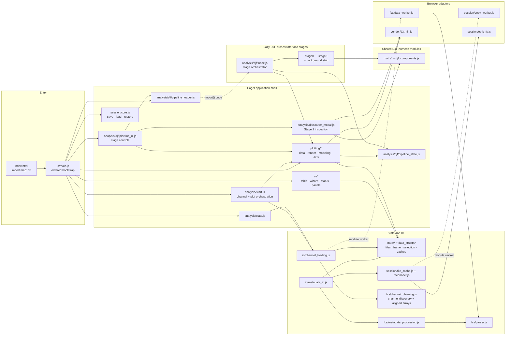
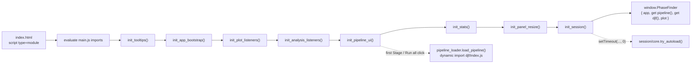
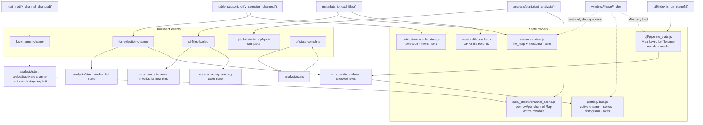
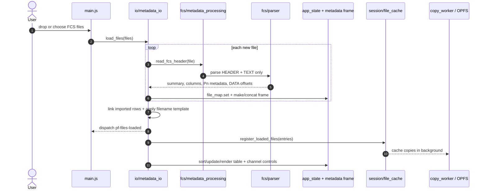
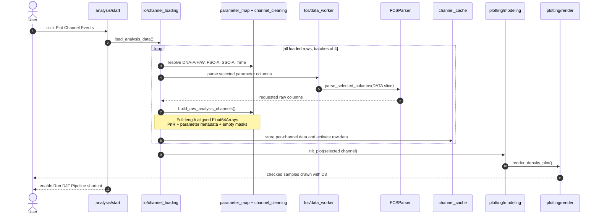
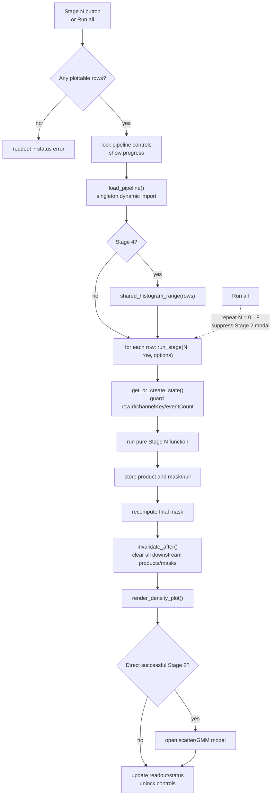
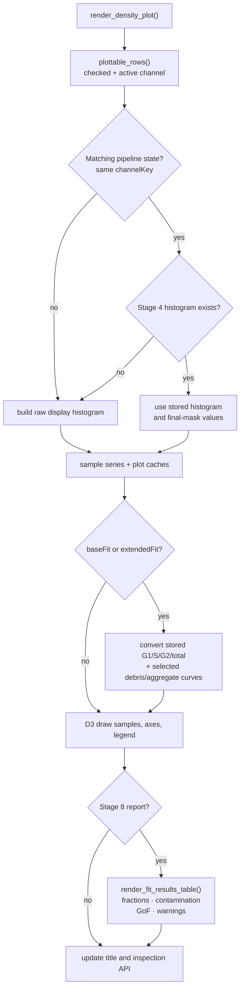
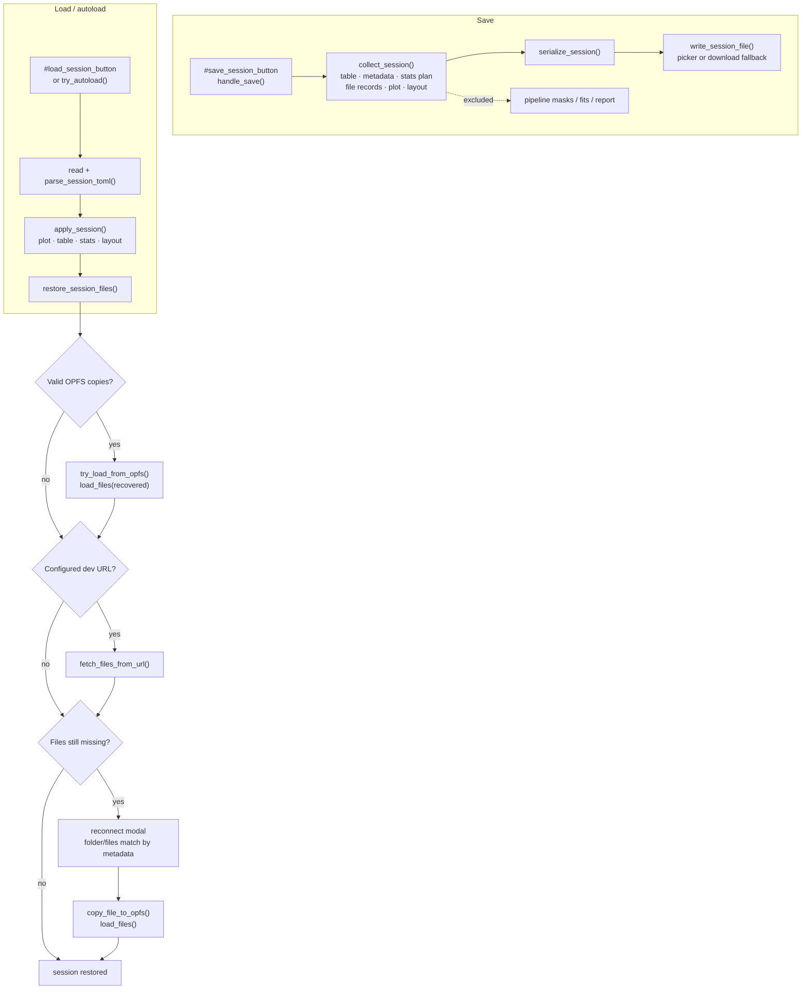

# PhaseFinder Code Flow Diagrams

These diagrams document the current ES-module browser application on the
`djf-pipeline` branch. They separate module topology, state ownership, FCS data
loading, the staged Dean–Jett–Fox pipeline, rendering, and session restore so
each diagram remains useful at a readable scale.

Key architectural facts:

- `index.html` loads one module entry, `js/main.js`; imports define runtime
  ordering after the explicit `init_*()` bootstrap.
- D3 is the only vendored third-party module. Peak detection and nonlinear
  fitting are repository-native modules under `js/analysis/djf/`.
- `pipeline_loader.js` lazy-loads `djf/index.js` on the first stage action.
  Pipeline UI, state-aware rendering, and the Stage 2 scatter viewer are part of
  the eager application shell.
- Loaded event channels remain full-length and aligned to original FCS event
  indexes. Stage 0–3 masks are composed without compacting those arrays.
- Pipeline state is per sample and guarded by row id, channel key, and event
  count. Re-running an upstream stage invalidates every downstream product.
- `render_density_plot()` reads stored pipeline outputs; it never fits a model.

## 1. Runtime module topology

Solid arrows are ordinary ES imports. Dashed arrows identify a dynamic import
or a module worker boundary. The diagram shows responsibility regions rather
than claiming a strictly acyclic import graph—plot rendering and initialization
contain a few intentional ES-module cycles.

## 2. Ordered startup bootstrap

Module evaluation resolves imports first. The explicit bootstrap then installs
listeners in a deliberate order and finally publishes the debug/automation
hook. Both `pipeline` and the compatibility alias `djf` are null until the
pipeline core has actually loaded.

## 3. State ownership and runtime contracts

Direct imports handle most communication. Custom events are used where one user
action has multiple downstream consumers. Pipeline masks/results are runtime
state and are intentionally not part of session serialization.

## 4. Two-phase FCS loading

Initial file load reads only HEADER/TEXT metadata. Event DATA is loaded later,
in batches, when a DNA-area channel is plotted. All pipeline companion channels
are loaded together and retained as original-index `Float64Array` values.

## 5. Staged DJF dataflow

Stages 1–3 are optional. When their required channels are unavailable, their
mask slot remains null and prior masks still apply. Stage 5 records peak-pair
diagnostics, but Stage 6 initializes and fits independently from the Stage 4
histogram; a `found:false` Stage 5 result does not stop Run all.

```mermaid
flowchart LR
  RAW["Raw original-index channels<br/>DNA-A/H/W · FSC-A · SSC-A · Time"] --> S0["Stage 0<br/>Structural QC<br/>structural mask"]
  S0 --> S1["Stage 1 optional<br/>Time QC<br/>time mask or null"]
  S1 --> S2["Stage 2 optional<br/>FSC/SSC GMM<br/>scatter mask or null"]
  S2 --> S3["Stage 3 optional<br/>pulse-geometry ridge<br/>singlet mask or null"]
  S3 --> FINAL["Final mask<br/>AND all non-null masks"]
  FINAL --> S4["Stage 4<br/>shared-range DNA histogram"]
  S4 --> S5["Stage 5<br/>near-2:1 peak diagnostics"]
  S4 --> S6["Stage 6<br/>constrained base DJF fit"]
  S5 -. "diagnostic only" .-> REPORTING["state.peaks"]
  S6 --> S7["Stage 7 optional<br/>debris/aggregate candidates<br/>conservative model selection"]
  S6 --> CHOOSE["baseFit"]
  S7 --> CHOOSE["extendedFit when selected"]
  CHOOSE --> S8["Stage 8<br/>1C/S/2C fractions<br/>contamination + GoF<br/>residual diagnostics + warnings"]
  S8 --> BG["General background<br/>explicitly unspecified stub"]
```

## 6. Manual-stage orchestration and invalidation

The UI runs one selected stage across all currently plottable samples. Run all
loops through the same UI path from Stage 0 to Stage 8. Every stage redraws, so
rerunning upstream work immediately removes stale downstream visuals.

## 7. State-aware render path

The render pass chooses the newest valid stored checkpoint for each active row.
It does not call any numerical stage function.

## 8. Session save, load, and reconnect

Sessions serialize metadata, table state, channel/plot settings, statistics
plans, file records, and layout. DJF masks, fits, and reports are runtime-only;
legacy correction flags are written as false for compatibility.

