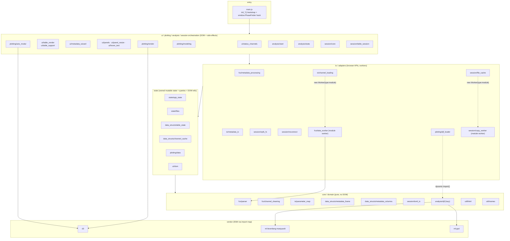
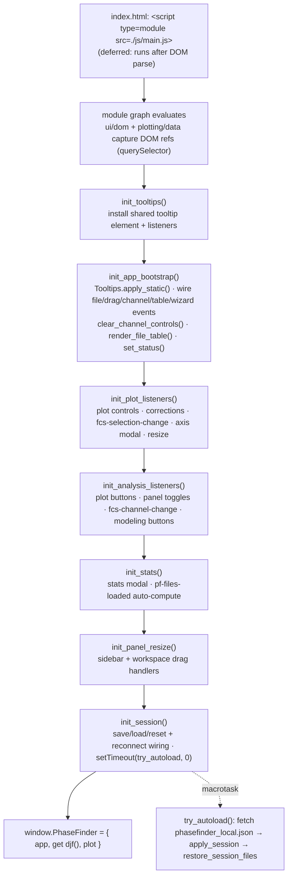
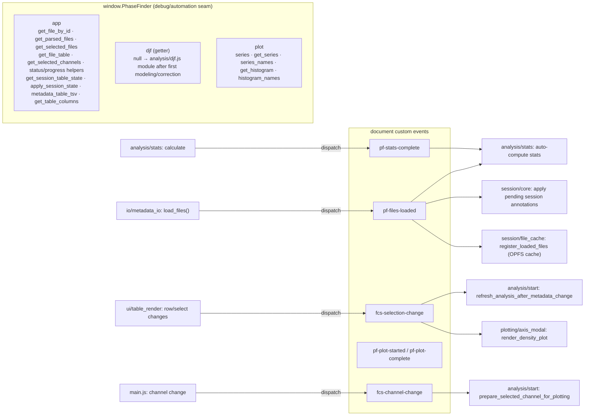
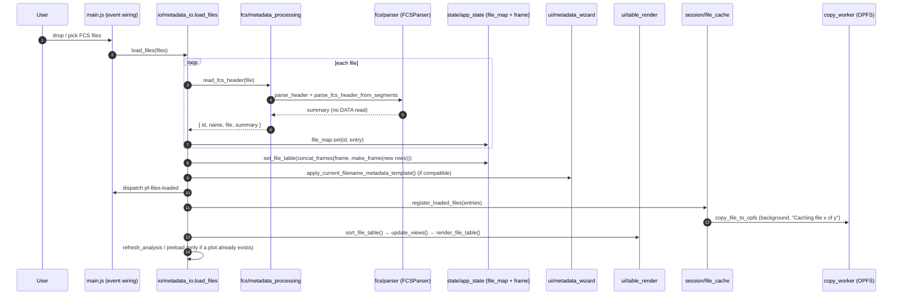
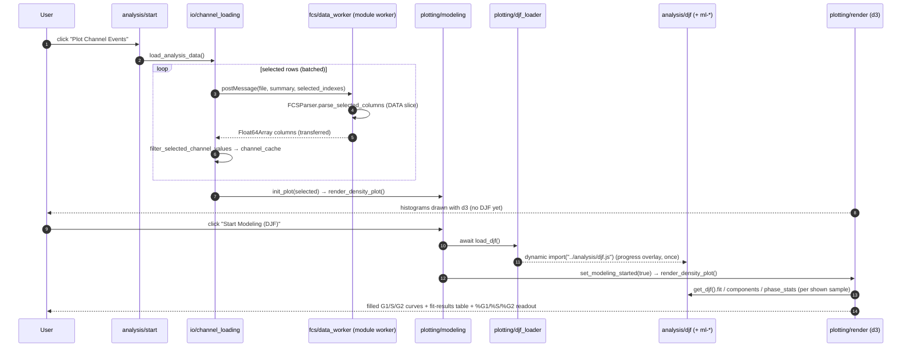
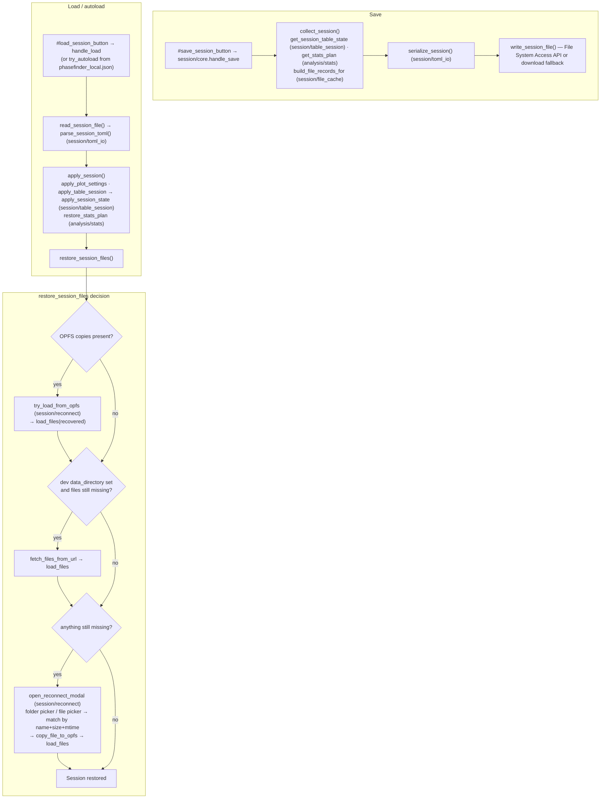

# PhaseFinder Code Flow Diagrams

These diagrams document the browser app (everything under `js/`) after the
conversion to native ES modules. Rather than one giant map, the structure is
split into several focused diagrams so each stays readable: the module
dependency layers, the ordered startup bootstrap, the cross-module contracts
(the single debug hook + custom events), and the three main runtime flows (file
load, plotting/modeling, and session save/load).

Key facts that shape every diagram:

- The app loads as a **single ES-module entry** (`index.html` →
  `<script type="module" src="./js/main.js">`). There is no hand-maintained
  script order; the dependency graph is the `import` statements.
- Internal wiring is 100% ES imports. The **only** global is the deliberate debug
  hook `window.PhaseFinder = { app, djf, plot }`.
- The **DJF numeric stack** (`analysis/djf.js` + `ml-levenberg-marquardt` +
  `ml-gsd`) is **lazy-loaded** via `plotting/djf_loader.js` on the first
  correction/modeling action, so it stays off the initial load path.
- d3 and the ml-\* libraries are **vendored ESM** (`js/vendor/`) mapped via the
  import map. Two **module workers** (`fcs/data_worker.js`,
  `session/copy_worker.js`) import local files directly.

## 1. Module dependency layers

Imports point from outer layers to inner ones only (an importer → what it
imports). The dashed edge is the lazy `import()` of the DJF stack; the dotted
edges are the two module workers.

## 2. Startup bootstrap (replaces the old script order)

`main.js` imports the whole graph, then runs the `init_*()` functions in
dependency order and finally assigns the debug hook. `init_session()` defers
`try_autoload()` to a macrotask so the rest of the bootstrap finishes first.

## 3. Cross-module contract: the single hook + custom events

The former per-namespace globals collapse into one hook (`window.PhaseFinder`);
`djf` is a getter over the lazily loaded module (null until first modeling).
Modules coordinate at runtime through a handful of `document` custom events.

## 4. Flow A — FCS file load → metadata table

## 5. Flow B — Plot channel events → lazy DJF → modeling

Note: enabling **debris/doublet corrections** takes the same lazy path — the
render pass sees `needs_djf` and triggers `load_djf()`, drawing the raw
histogram immediately and redrawing corrected once the module resolves.

## 6. Session save / load / restore

