# PhaseFinder Code Flow Diagrams

These diagrams document the browser app code outside tests, sample data, binary
assets, and git metadata. HTML and CSS are shown as structural entrypoints.
JavaScript modules list their named functions and public browser globals.

## Giant Project And Function Map

```mermaid
flowchart LR
  subgraph entry["index.html, styles, external libraries"]
    direction TB
    HTMLShell["index.html app shell<br/>header, sidebar, metadata table, plot panel, modals, status bar"]
    CSSFiles["CSS cascade<br/>base.css, layout.css, sidebar.css, table.css, plot.css, feedback.css, responsive.css<br/>help.css for help.html"]
    ExternalLibs["External libraries<br/>d3 v7<br/>ml-levenberg-marquardt<br/>ml-gsd"]
    ScriptOrder["Script load order<br/>fcs-parser, hover_text, ui_controls, main, djf_gpt, plotting, analysis, summary_stats, panel_resize, opfs_store, session"]
    HTMLShell --> CSSFiles
    HTMLShell --> ExternalLibs
    HTMLShell --> ScriptOrder
  end

  subgraph globals["Public globals and custom events"]
    direction TB
    GParser["globalThis.FCSParser<br/>parse_fcs, parse_fcs_header, parse_fcs_header_from_segments, parse_header, parse_selected_columns"]
    GHover["window.PhaseFinderHoverText"]
    GTooltips["window.PhaseFinderTooltips<br/>text, set_quick_tooltip, set_native_title, apply_static"]
    GApp["window.PhaseFinderApp<br/>get_file_by_id, get_parsed_files, get_selected_files, get_file_table, set_file_table<br/>get_selected_channels, set_status, set_status_bar, show_progress, update_progress, hide_progress, next_frame<br/>get_session_table_state, apply_session_state, save_metadata_template"]
    GDJF["window.PhaseFinderDJF<br/>prepare_row, estimate_run_g1, fit, components, fractions, phase_stats, correction_summary, find_auxiliary_indexes"]
    GStats["window.PhaseFinderSummaryStats<br/>compute_column_stats, open_modal, close_modal, get_stats_plan, restore_stats_plan, clear_stats_plan"]
    GOPFS["window.PhaseFinderOPFS<br/>supports_opfs, get_opfs_root, ensure_directory, split_opfs_path, read_file_from_opfs, delete_opfs_path, request_persistent_storage, get_storage_estimate"]
    GSession["window.PhaseFinderSessionFiles<br/>register_loaded_files"]
    GReconnect["window.PhaseFinderReconnect<br/>is_test_mode, get_records, is_open, reconnect_with_files, open, close"]
    EvFiles["pf-files-loaded"]
    EvSelection["fcs-selection-change"]
    EvChannel["fcs-channel-change"]
    EvPlot["pf-plot-started and pf-plot-complete"]
    EvStats["pf-stats-complete"]
    EvResize["window resize"]
  end

  subgraph fcs["js/fcs-parser.js"]
    direction TB
    FCSHeader["Header and TEXT helpers<br/>read_ascii, parse_offset, parse_header, parse_text_segment, normalize_keyword, keyword"]
    FCSMeta["Metadata summary helpers<br/>is_little_endian, parameter_columns, summarize_fcs_header, parse_fcs_header, parse_fcs_header_from_segments"]
    FCSData["DATA readers<br/>integer_reader, parameter_byte_widths, read_data_value, parse_data, parse_selected_columns, parse_fcs"]
    FCSHeader --> FCSMeta
    FCSHeader --> FCSData
    FCSMeta --> GParser
    FCSData --> GParser
  end

  subgraph hover["js/hover_text.js"]
    direction TB
    HoverText["Tooltip text registry<br/>PhaseFinderHoverText"]
    HoverAPI["Tooltip API methods<br/>text, set_quick_tooltip, set_native_title, apply_static"]
    HoverRuntime["Shared tooltip runtime<br/>show, hide<br/>mouseover, focusin, focusout, scroll, resize listeners"]
    HoverText --> GHover
    HoverAPI --> GTooltips
    HoverRuntime --> GTooltips
  end

  subgraph ui["js/ui_controls.js"]
    direction TB
    UIFrame["PhaseFinderFrame class<br/>constructor, length, columns, col, setCol<br/>make_frame, concat_frames, frame_to_rows"]
    UIColumns["Metadata column and row model<br/>metadata_field_from_label, unique_metadata_label, normalize_metadata_columns<br/>metadata_row_is_linked, loaded_file_count, metadata_unlinked_row_id, loaded_file_by_metadata_key<br/>build_metadata_frame_from_records, should_preserve_metadata_row_order, table_base_field_set, table_stat_columns, set_metadata_table_columns, sync_file_annotations"]
    UIStatus["Status, progress, and channel controls<br/>create_id, set_status, set_status_bar, update_loaded_files_list, update_drop_zone_text<br/>show_progress, update_progress, hide_progress, next_frame, clear_channel_controls<br/>unique_columns, unique_column_values, populate_single_select, suggest_column, populate_channel_controls, select_if_option_exists, update_start_button_state"]
    UIImportExport["Metadata import and export<br/>current_metadata_columns, rebuild_table_with_metadata_columns, add_manual_metadata_column, open_metadata_import_picker<br/>detect_metadata_delimiter, parse_delimited_metadata, normalized_metadata_header, find_metadata_filename_column, metadata_filename_key, loaded_file_index_by_metadata_key<br/>import_metadata_records, handle_metadata_import_file, tsv_cell, metadata_export_columns, metadata_table_tsv, save_blob, handle_metadata_table_export"]
    UIWizard["Filename metadata wizard<br/>display_name, load_filename_metadata_template, normalize_filename_metadata_template, save_filename_metadata_template<br/>default_metadata_split_steps, parse_fixed_breaks, collect_metadata_split_steps, current_metadata_wizard_spec<br/>metadata_split_step_controls, render_metadata_split_steps, split_text_binary_step, split_filename_metadata, metadata_part_count<br/>current_column_editor_state, render_metadata_column_editor, metadata_wizard_columns_from_editor, render_metadata_wizard_preview, fill_metadata_wizard_from_template<br/>add_metadata_split_step, open_metadata_wizard, close_metadata_wizard, set_fixed_width_breaks_from_width<br/>handle_metadata_split_step_input, handle_metadata_split_step_click, apply_filename_metadata_columns, can_auto_apply_filename_metadata_template<br/>apply_current_filename_metadata_template, apply_metadata_wizard, reset_filename_metadata_columns, schedule_metadata_wizard_after_file_load, link_existing_metadata_row_to_loaded_entry"]
    UIRender["Table rendering and table UI<br/>notify_selection_changed, set_sidebar_collapsed, toggle_sidebar, displayed_files, sort_indicator, filter_control<br/>header_label_control, header_cell, header_label_cell, header_filter_cell<br/>render_file_table, update_select_all_checkbox, handle_metadata_header_input, finalize_metadata_header_input, finalize_metadata_header_by_field<br/>handle_table_change, handle_table_click, handle_document_click, annotation_input_size, update_views, guess_annotations_from_filename, timepoint_sort_value, sort_file_table"]
    UILocalHelpers["Local render/layout helpers<br/>notify_layout_changed, cell, fmt"]
    UIFrame --> UIColumns
    UIColumns --> UIImportExport
    UIColumns --> UIWizard
    UIStatus --> UIRender
    UIImportExport --> UIRender
    UIWizard --> UIRender
    UIRender --> EvSelection
    UIRender --> EvResize
  end

  subgraph main["js/main.js"]
    direction TB
    MainLoad["FCS metadata loading<br/>read_fcs_header, has_initialized_plot, refresh_downstream_after_file_load, load_files"]
    MainAnnotate["Annotation and escaping<br/>update_annotation, escape_html"]
    MainEvents["Main UI events<br/>notify_channel_changed, open_file_browser, set_upload_target_dragging, hard_restart"]
    MainSelected["Selected channel API<br/>get_selected_channels"]
    MainListeners["Listeners<br/>file input, drag/drop upload, sidebar toggle, channel selects, table input/change/click<br/>metadata wizard/import/export buttons, document click, Escape key"]
    MainLoad --> EvFiles
    MainEvents --> EvChannel
    MainSelected --> GApp
    MainLoad --> GApp
    MainAnnotate --> GApp
    MainListeners --> MainLoad
    MainListeners --> MainAnnotate
    MainListeners --> MainEvents
  end

  subgraph djf["js/djf_gpt.js"]
    direction TB
    DJFNumbers["Numeric and histogram helpers<br/>finite_number, positive_number, sorted_finite, quantile_sorted, median_sorted, robust_sigma, build_histogram"]
    DJFPeaks["Peak and debris detection<br/>detect_peaks, best_g1g2_pair, nearest_y, estimate_sigma_from_peak, estimate_g1_from_points, debris_bounds"]
    DJFMasks["Event correction masks<br/>combine_mask, compact_by_mask, robust_ratio_mask, apply_aggregate_mask, prepare_row"]
    DJFModel["Model math and fit<br/>gaussian, s_phase_height, components, model, seed_fit, estimate_run_g1, fit, phase_stats, fractions, correction_summary"]
    DJFAux["Auxiliary channel matching<br/>normalize_name, measurement_kind, measurement_base, param_fields, find_linked_param, find_auxiliary_indexes"]
    DJFNumbers --> DJFPeaks
    DJFPeaks --> DJFMasks
    DJFPeaks --> DJFModel
    DJFMasks --> GDJF
    DJFModel --> GDJF
    DJFAux --> GDJF
  end

  subgraph plot["js/plotting.js"]
    direction TB
    PlotPrep["Plot helpers<br/>css_color, strip_fcs, plot_escape_html, format_fit_number, plot_bin_count, correction_state, plottable_rows<br/>sample_color, build_color_assigner, shared_range, shared_range_for_values, axis_opts, histogram_curve"]
    PlotRender["Main plotting and modeling UI<br/>update_plot_title, render_fit_results_table, reset_modeling_state, init_plot, start_modeling, toggle_fit, render_density_plot"]
    PlotAxis["Axis range modal and resize<br/>open_axis_range_modal, close_axis_range_modal, apply_axis_range_modal, schedule_plot_resize"]
    PlotLocalHelpers["Local render helpers<br/>strain_of, at, style_axis, component, position_at, clamp_value, placeholder, parse"]
    PlotListeners["Listeners<br/>plot controls, correction toggles, fcs-selection-change, axis modal buttons, axis modal drag, ResizeObserver, window resize"]
    PlotPrep --> PlotRender
    PlotRender --> PlotAxis
    PlotRender --> PlotLocalHelpers
    PlotListeners --> PlotRender
    PlotListeners --> PlotAxis
    PlotRender --> EvResize
  end

  subgraph analysis["js/analysis.js"]
    direction TB
    AnalysisPanels["Panel controls<br/>set_metadata_panel_collapsed, collapse_metadata_panel, toggle_metadata_panel<br/>set_plot_panel_collapsed, toggle_plot_panel"]
    AnalysisIndexes["Channel and cache helpers<br/>parameter_map, find_param_index, unique_indexes, analysis_data_key, cached_analysis_data<br/>store_analysis_data, is_analysis_data_loaded, activate_analysis_data, selected_indexes_for_file"]
    AnalysisWorker["FCS worker driver<br/>get_fcs_data_worker, load_selected_fcs_columns_in_worker, load_selected_fcs_columns"]
    AnalysisLoad["Analysis loading<br/>load_analysis_row, load_analysis_batch, load_analysis_data, refresh_analysis_after_metadata_change, preload_analysis_rows_in_background"]
    AnalysisMode["Plot/modeling actions<br/>set_plot_action_controls_disabled, enter_plotting_mode, prepare_selected_channel_for_plotting, enter_modeling_mode, start_analysis"]
    AnalysisLocalHelpers["Local layout/request helpers<br/>notify_layout_changed, promise"]
    AnalysisListeners["Listeners<br/>panel toggles, plot buttons, fcs-selection-change, fcs-channel-change, cell-cycle modeling buttons"]
    AnalysisPanels --> EvResize
    AnalysisIndexes --> AnalysisWorker
    AnalysisWorker --> AnalysisLoad
    AnalysisLoad --> AnalysisMode
    AnalysisMode --> EvPlot
    AnalysisListeners --> AnalysisPanels
    AnalysisListeners --> AnalysisMode
    AnalysisListeners --> AnalysisLoad
  end

  subgraph stats["js/summary_stats.js"]
    direction TB
    StatsSession["Stats session state<br/>record_stats, get_stats_plan, restore_stats_plan, clear_stats_plan, rebuild_session_from_frame, compute_stats_for_new_files"]
    StatsCompute["Stats compute<br/>compute_column_stats"]
    StatsModal["Stats modal workflow<br/>open_stats_modal, close_stats_modal, update_stats_checkboxes, show_stats_error"]
    StatsListeners["Listeners<br/>pf-stats-complete, pf-files-loaded, modal change, channel change, calculate click, stats buttons, Escape key"]
    StatsSession --> StatsCompute
    StatsModal --> StatsCompute
    StatsListeners --> StatsSession
    StatsListeners --> StatsModal
    StatsCompute --> GStats
    StatsModal --> GStats
    StatsSession --> GStats
  end

  subgraph resize["js/panel_resize.js"]
    direction TB
    ResizeSidebar["Sidebar resizer listeners<br/>mousedown, mousemove, mouseup"]
    ResizeWorkspace["Workspace resizer listeners<br/>sync_resizer_state, MutationObserver, mousedown, mousemove, mouseup"]
    ResizeSidebar --> EvResize
    ResizeWorkspace --> EvResize
  end

  subgraph opfs["js/opfs_store.js"]
    direction TB
    OPFSStore["OPFS storage helpers<br/>supports_opfs, get_opfs_root, ensure_directory, split_opfs_path, read_file_from_opfs<br/>delete_opfs_path, request_persistent_storage, get_storage_estimate"]
    OPFSStore --> GOPFS
  end

  subgraph session["js/session.js"]
    direction TB
    SessionToml["TOML serialization and parsing<br/>toml_str, serialize_session, p, split_csv, parse_toml_value, parse_inline_table, get_path, parse_session_toml"]
    SessionIDB["Directory handle and legacy file loading<br/>open_idb, idb_put, idb_get, files_from_dir_handle, pick_dir_chromium, pick_dir_fallback, fetch_files_from_url, auto_load_session_files"]
    SessionRecords["File record registry<br/>OPFS, is_test_mode, esc, human_size, is_resolved, make_file_record, build_file_records_for, set_records_from_session"]
    SessionCache["OPFS cache worker driver<br/>get_opfs_copy_worker, copy_file_to_opfs, enqueue_opfs_cache, run_cache_queue, register_loaded_files"]
    SessionReconnect["OPFS restore and reconnect<br/>try_load_from_opfs, index_selected_files, match_record_to_selected_file, is_acceptable_match<br/>render_reconnect_list, open_reconnect_modal, close_reconnect_modal, apply_reconnected_files, reconnect_from_directory, reconnect_from_files, finish_reconnect"]
    SessionState["Session state orchestration<br/>restore_session_files, collect_session, apply_plot_settings, apply_table_session, apply_session"]
    SessionIO["Session file IO and startup<br/>write_session_file, read_session_file, handle_save, handle_load, try_autoload"]
    SessionListeners["Listeners<br/>pf-files-loaded, save/load buttons, reconnect buttons, reconnect backdrop"]
    SessionToml --> SessionState
    SessionIDB --> SessionState
    SessionRecords --> SessionCache
    SessionRecords --> SessionReconnect
    SessionCache --> GSession
    SessionReconnect --> GReconnect
    SessionState --> SessionIO
    SessionListeners --> SessionState
    SessionListeners --> SessionIO
    SessionListeners --> SessionReconnect
  end

  subgraph workers["Worker files"]
    direction TB
    FCSWorker["js/fcs_data_worker.js<br/>importScripts fcs-parser<br/>message listener reads DATA slice<br/>globalThis.FCSParser.parse_selected_columns<br/>postMessage columns as Float64Array transfers"]
    OPFSCopyWorker["js/opfs_copy_worker.js<br/>ensure_directory, split_opfs_path, write_file_to_opfs<br/>message listener writes File to OPFS<br/>postMessage ok or error"]
  end

  ScriptOrder --> FCSHeader
  ScriptOrder --> HoverText
  ScriptOrder --> UIFrame
  ScriptOrder --> MainListeners
  ScriptOrder --> DJFNumbers
  ScriptOrder --> PlotPrep
  ScriptOrder --> AnalysisPanels
  ScriptOrder --> StatsSession
  ScriptOrder --> ResizeSidebar
  ScriptOrder --> OPFSStore
  ScriptOrder --> SessionToml

  ExternalLibs --> PlotRender
  ExternalLibs --> DJFPeaks
  ExternalLibs --> DJFModel

  MainLoad --> GParser
  MainLoad --> UIFrame
  MainLoad --> UIRender
  MainLoad --> AnalysisLoad
  MainLoad -- "pf-files-loaded" --> EvFiles
  EvFiles --> StatsSession
  EvFiles --> SessionState
  EvFiles --> SessionCache

  MainEvents -- "fcs-channel-change" --> EvChannel
  EvChannel --> AnalysisMode
  UIStatus --> GApp
  UIImportExport --> GApp
  UIWizard --> GApp
  UIRender --> GApp
  MainListeners --> GTooltips

  AnalysisMode --> GApp
  AnalysisLoad --> GApp
  AnalysisIndexes --> GDJF
  AnalysisWorker --> FCSWorker
  FCSWorker --> GParser
  AnalysisMode --> PlotRender

  EvSelection --> AnalysisLoad
  EvSelection --> PlotRender
  EvResize --> PlotRender

  PlotRender --> GApp
  PlotRender --> GDJF
  PlotRender --> ExternalLibs
  PlotRender --> GTooltips

  StatsSession --> AnalysisLoad
  StatsModal --> AnalysisLoad
  StatsCompute --> UIRender
  StatsListeners -- "pf-stats-complete" --> EvStats
  EvStats --> StatsSession

  SessionCache --> GOPFS
  SessionCache --> OPFSCopyWorker
  OPFSCopyWorker --> GOPFS
  SessionState --> GApp
  SessionState --> GStats
  SessionReconnect --> MainLoad
  SessionIO --> SessionToml

  ResizeSidebar --> PlotRender
  ResizeWorkspace --> PlotRender
```

## Typical Workflow With Non-Duplicated Function Groups

```mermaid
flowchart TD
  Start["1. Open PhaseFinder in the browser"]
  PageBoot["HTML/CSS/external setup<br/>index.html app shell<br/>CSS cascade<br/>d3, ml-levenberg-marquardt, ml-gsd<br/>script load order"]
  GlobalsReady["Public globals ready<br/>FCSParser, PhaseFinderTooltips, PhaseFinderApp, PhaseFinderDJF, PhaseFinderSummaryStats, PhaseFinderOPFS, PhaseFinderSessionFiles, PhaseFinderReconnect"]

  LoadUI["2. Drop or choose FCS files"]
  LoadFns["File metadata load path<br/>open_file_browser, set_upload_target_dragging, load_files, read_fcs_header<br/>FCSParser.parse_header, FCSParser.parse_fcs_header_from_segments<br/>make_frame, concat_frames, link_existing_metadata_row_to_loaded_entry<br/>apply_current_filename_metadata_template, sync_file_annotations, sort_file_table<br/>update_views, update_drop_zone_text, schedule_metadata_wizard_after_file_load"]
  FilesLoadedEvent["Custom event<br/>pf-files-loaded"]

  MetadataUI["3. Edit, split, import, export, sort, filter, or select metadata rows"]
  MetadataFns["Metadata and table functions<br/>update_annotation, handle_table_change, handle_table_click, handle_document_click<br/>add_manual_metadata_column, open_metadata_import_picker, handle_metadata_import_file, import_metadata_records<br/>open_metadata_wizard, render_metadata_wizard_preview, apply_metadata_wizard, reset_filename_metadata_columns<br/>handle_metadata_table_export, render_file_table, update_select_all_checkbox, notify_selection_changed"]
  SelectionEvent["Custom event<br/>fcs-selection-change"]

  ChannelUI["4. Choose a channel"]
  ChannelFns["Channel functions<br/>populate_channel_controls, suggest_column, get_selected_channels, update_start_button_state, notify_channel_changed"]
  ChannelEvent["Custom event<br/>fcs-channel-change"]

  PlotUI["5. Click Plot Channel Events"]
  AnalysisFns["Analysis loading functions<br/>start_analysis, load_analysis_data, load_analysis_batch, load_analysis_row<br/>selected_indexes_for_file, load_selected_fcs_columns, load_selected_fcs_columns_in_worker, get_fcs_data_worker<br/>store_analysis_data, activate_analysis_data, refresh_analysis_after_metadata_change, prepare_selected_channel_for_plotting"]
  FCSWorkerFns["Selected-column worker path<br/>fcs_data_worker message listener<br/>FCSParser.parse_selected_columns<br/>main-thread fallback when worker unavailable"]
  PlotFns["Plot rendering functions<br/>init_plot, render_density_plot, plottable_rows, correction_state, shared_range_for_values<br/>axis_opts, histogram_curve, build_color_assigner, update_plot_title, render_fit_results_table"]
  PlotEvents["Custom events<br/>pf-plot-started and pf-plot-complete"]

  ModelingUI["6. Run Cell Cycle Modeling or adjust plot controls"]
  ModelingFns["Modeling and plot-control functions<br/>enter_modeling_mode, start_modeling, toggle_fit, reset_modeling_state<br/>PhaseFinderDJF.prepare_row, estimate_run_g1, fit, components, phase_stats, correction_summary<br/>open_axis_range_modal, apply_axis_range_modal, close_axis_range_modal, schedule_plot_resize"]

  StatsUI["7. Calculate summary statistics"]
  StatsFns["Statistics functions<br/>open_stats_modal, update_stats_checkboxes, compute_column_stats, close_stats_modal<br/>record_stats, get_stats_plan, restore_stats_plan, clear_stats_plan, rebuild_session_from_frame, compute_stats_for_new_files"]
  StatsEvent["Custom event<br/>pf-stats-complete"]

  SessionUI["8. Save, load, restore, or reconnect a session"]
  SessionFns["Session functions<br/>collect_session, serialize_session, write_session_file, read_session_file, parse_session_toml<br/>apply_session, apply_table_session, apply_plot_settings, restore_session_files<br/>try_load_from_opfs, register_loaded_files, enqueue_opfs_cache, run_cache_queue, copy_file_to_opfs<br/>open_reconnect_modal, reconnect_from_directory, reconnect_from_files, apply_reconnected_files, finish_reconnect, try_autoload"]
  OPFSWorkerFns["OPFS worker path<br/>opfs_copy_worker message listener<br/>write_file_to_opfs, ensure_directory, split_opfs_path<br/>PhaseFinderOPFS read/write helpers"]

  LayoutUI["9. Resize, collapse, and tooltip interactions can occur throughout"]
  LayoutFns["Layout and tooltip functions<br/>set_sidebar_collapsed, toggle_sidebar, set_metadata_panel_collapsed, toggle_metadata_panel<br/>set_plot_panel_collapsed, toggle_plot_panel, sync_resizer_state<br/>PhaseFinderTooltips.apply_static, text, set_quick_tooltip, set_native_title<br/>tooltip show, tooltip hide"]
  ResizeEvent["Browser event<br/>window resize"]

  Start --> PageBoot --> GlobalsReady
  GlobalsReady --> LoadUI
  LoadUI --> LoadFns --> FilesLoadedEvent
  FilesLoadedEvent --> MetadataFns
  FilesLoadedEvent --> StatsFns
  FilesLoadedEvent --> SessionFns

  MetadataUI --> MetadataFns --> SelectionEvent
  SelectionEvent --> AnalysisFns
  SelectionEvent --> PlotFns

  ChannelUI --> ChannelFns --> ChannelEvent
  ChannelEvent --> AnalysisFns

  PlotUI --> AnalysisFns --> FCSWorkerFns --> PlotFns --> PlotEvents
  PlotEvents --> ModelingUI

  ModelingUI --> ModelingFns --> PlotFns
  StatsUI --> StatsFns --> AnalysisFns
  StatsFns --> StatsEvent
  StatsEvent --> MetadataFns

  SessionUI --> SessionFns
  SessionFns --> LoadFns
  SessionFns --> OPFSWorkerFns
  OPFSWorkerFns --> SessionFns

  LayoutUI --> LayoutFns --> ResizeEvent
  ResizeEvent --> PlotFns

  MetadataUI -. "user may continue before or after plotting" .-> ChannelUI
  ChannelUI -. "when files and channel are ready" .-> PlotUI
  PlotUI -. "after a plot exists" .-> StatsUI
  PlotUI -. "session can be saved anytime" .-> SessionUI
```

## Expanded Readable Function Call Graph

This graph favors readable spacing over compactness. It shows the main caller
chains that reach each function group; the full function inventory is in the
giant map above.

```mermaid
%%{init: {"flowchart": {"nodeSpacing": 90, "rankSpacing": 140, "curve": "basis"}, "themeVariables": {"fontSize": "16px"}}}%%
flowchart TB
  subgraph startup["Startup and global setup"]
    direction TB
    S0["index.html loads CSS and scripts"]
    S1["fcs-parser.js<br/>read_ascii -> parse_offset -> parse_header<br/>parse_text_segment -> normalize_keyword -> keyword<br/>parameter_columns -> summarize_fcs_header<br/>parse_fcs_header / parse_fcs_header_from_segments<br/>integer_reader -> parameter_byte_widths -> read_data_value<br/>parse_data / parse_selected_columns / parse_fcs"]
    S2["hover_text.js<br/>PhaseFinderHoverText registry<br/>PhaseFinderTooltips.text -> set_quick_tooltip / set_native_title / apply_static<br/>tooltip runtime show / hide"]
    S3["ui_controls.js initializes table state<br/>PhaseFinderFrame constructor / length / columns / col / setCol<br/>clear_channel_controls -> render_file_table -> update_drop_zone_text"]
    S4["main.js starts app<br/>PhaseFinderTooltips.apply_static<br/>set_status / set_status_bar<br/>registers listeners and exposes PhaseFinderApp"]
    S5["djf_gpt.js exposes PhaseFinderDJF<br/>numeric helpers -> peak helpers -> correction masks -> model fit helpers"]
    S6["plotting.js registers plot listeners<br/>control changes -> render_density_plot<br/>ResizeObserver / resize -> schedule_plot_resize"]
    S7["analysis.js registers analysis listeners<br/>panel buttons -> panel toggles<br/>plot buttons -> start_analysis<br/>selection/channel events -> refresh/prepare"]
    S8["summary_stats.js registers stats listeners<br/>stats buttons -> open_stats_modal<br/>pf-files-loaded -> compute_stats_for_new_files<br/>pf-stats-complete -> record_stats"]
    S9["panel_resize.js, opfs_store.js, session.js<br/>resize listeners, PhaseFinderOPFS, session save/load/reconnect listeners"]
    S0 --> S1 --> S2 --> S3 --> S4 --> S5 --> S6 --> S7 --> S8 --> S9
  end

  subgraph loadflow["File load and metadata table call chain"]
    direction TB
    L0["User file input or drop<br/>#file_input / #drop_zone / #collapsed_upload_target"]
    L1["open_file_browser / set_upload_target_dragging"]
    L2["load_files"]
    L3["read_fcs_header"]
    L4["FCSParser.parse_header<br/>FCSParser.parse_fcs_header_from_segments"]
    L5["create_id<br/>link_existing_metadata_row_to_loaded_entry<br/>make_frame / concat_frames"]
    L6["can_auto_apply_filename_metadata_template ?<br/>apply_current_filename_metadata_template<br/>apply_filename_metadata_columns<br/>split_filename_metadata -> split_text_binary_step"]
    L7["sync_file_annotations<br/>sort_file_table<br/>update_views"]
    L8["render_file_table<br/>displayed_files -> frame_to_rows<br/>sort_indicator / filter_control / header cells<br/>annotation_input_size<br/>update_select_all_checkbox<br/>update_start_button_state"]
    L9["populate_channel_controls<br/>unique_columns -> suggest_column -> populate_single_select"]
    L10["dispatch pf-files-loaded"]
    L11["register_loaded_files<br/>make_file_record -> enqueue_opfs_cache -> run_cache_queue -> copy_file_to_opfs"]
    L12["schedule_metadata_wizard_after_file_load<br/>open_metadata_wizard -> fill_metadata_wizard_from_template -> render_metadata_wizard_preview"]
    L0 --> L1 --> L2 --> L3 --> L4 --> L5 --> L6 --> L7 --> L8 --> L9 --> L10
    L10 --> L11
    L10 --> L12
  end

  subgraph metadataflow["Metadata edit, import, export, sort, filter, and selection"]
    direction TB
    M0["#file_table input/change/click"]
    M1["update_annotation<br/>handle_metadata_header_input<br/>sync_file_annotations"]
    M2["handle_table_change<br/>filter checkbox -> column_filters -> render_file_table<br/>select all / row_select -> selected_file_ids"]
    M3["notify_selection_changed -> fcs-selection-change"]
    M4["handle_table_click<br/>metadata_header_ok -> finalize_metadata_header_by_field<br/>filter toggle -> open_filter_field<br/>sort arrow/button -> sort_state"]
    M5["handle_document_click closes filters"]
    M6["#metadata_add_column_button<br/>add_manual_metadata_column -> rebuild_table_with_metadata_columns"]
    M7["#metadata_import_button / #metadata_import_input<br/>open_metadata_import_picker -> handle_metadata_import_file<br/>detect_metadata_delimiter -> parse_delimited_metadata<br/>find_metadata_filename_column / metadata_filename_key<br/>import_metadata_records -> build_metadata_frame_from_records"]
    M8["#metadata_export_button<br/>handle_metadata_table_export -> metadata_table_tsv<br/>metadata_export_columns -> tsv_cell<br/>save_blob"]
    M9["#metadata_parse_button and wizard controls<br/>open_metadata_wizard -> render_metadata_split_steps<br/>collect_metadata_split_steps -> current_metadata_wizard_spec<br/>metadata_wizard_columns_from_editor -> apply_metadata_wizard<br/>reset_filename_metadata_columns / close_metadata_wizard"]
    M0 --> M1 --> L8
    M0 --> M2 --> M3
    M0 --> M4 --> L8
    M0 --> M5 --> L8
    M6 --> L8
    M7 --> L8
    M8 --> L8
    M9 --> L8
  end

  subgraph analysisplot["Channel, analysis, plotting, and DJF modeling call chain"]
    direction TB
    A0["#channel_select / #collapsed_channel_select change"]
    A1["notify_channel_changed -> fcs-channel-change"]
    A2["prepare_selected_channel_for_plotting<br/>enter_plotting_mode -> update_start_button_state"]
    A3["selected channel not loaded?<br/>load_analysis_batch -> load_analysis_row"]
    A4["selected_indexes_for_file<br/>parameter_map -> find_param_index<br/>PhaseFinderDJF.find_auxiliary_indexes<br/>unique_indexes"]
    A5["load_selected_fcs_columns<br/>load_selected_fcs_columns_in_worker -> get_fcs_data_worker<br/>fcs_data_worker message -> FCSParser.parse_selected_columns<br/>main-thread fallback uses FCSParser.parse_selected_columns"]
    A6["store_analysis_data / activate_analysis_data<br/>cached_analysis_data / is_analysis_data_loaded / analysis_data_key"]
    A7["#start_analysis_button / #collapsed_plot_button<br/>start_analysis -> dispatch pf-plot-started"]
    A8["load_analysis_data<br/>load_analysis_batch -> load_analysis_row"]
    A9["init_plot -> render_density_plot"]
    A10["render_density_plot<br/>plottable_rows -> correction_state<br/>PhaseFinderDJF.prepare_row<br/>shared_range_for_values -> axis_opts -> histogram_curve<br/>build_color_assigner -> sample_color<br/>update_plot_title"]
    A11["D3 drawing path<br/>render sample curves, legend, axis groups, threshold, fit table<br/>render_fit_results_table"]
    A12["dispatch pf-plot-complete<br/>enter_modeling_mode"]
    A13["#cell_cycle_modeling_button / #collapsed_cell_cycle_modeling_button<br/>start_modeling -> toggle_fit -> render_density_plot"]
    A14["DJF fit path<br/>detect_peaks -> best_g1g2_pair -> estimate_run_g1<br/>seed_fit -> fit -> model -> components -> gaussian / s_phase_height<br/>phase_stats / fractions / correction_summary"]
    A15["plot controls<br/>#plot_color_by, #plot_bins, #plot_debris_correction, #plot_doublet_correction, #plot_threshold_toggle<br/>render_density_plot / reset_modeling_state"]
    A16["axis modal<br/>open_axis_range_modal -> apply_axis_range_modal -> close_axis_range_modal"]
    A0 --> A1 --> A2 --> A3 --> A4 --> A5 --> A6 --> A9
    A7 --> A8 --> A4
    A8 --> A9 --> A10 --> A11 --> A12
    A13 --> A14 --> A10
    A15 --> A10
    A16 --> A10
  end

  subgraph statssessionlayout["Stats, sessions, OPFS, reconnect, and layout call chains"]
    direction TB
    T0["#calculate_stats_button / #collapsed_calculate_stats_button"]
    T1["open_stats_modal -> update_stats_checkboxes"]
    T2["#stats_calculate_button<br/>show_stats_error if invalid<br/>load_analysis_row for selected stats channel"]
    T3["compute_column_stats<br/>write CHANNEL:metric columns into PhaseFinderFrame<br/>render_file_table -> dispatch pf-stats-complete"]
    T4["record_stats / get_stats_plan / restore_stats_plan / clear_stats_plan<br/>rebuild_session_from_frame<br/>compute_stats_for_new_files on pf-files-loaded"]
    T5["#save_session_button<br/>handle_save -> collect_session -> serialize_session -> write_session_file"]
    T6["#load_session_button<br/>handle_load -> read_session_file -> parse_session_toml -> apply_session -> restore_session_files"]
    T7["restore from cache<br/>try_load_from_opfs -> PhaseFinderOPFS.read_file_from_opfs -> load_files"]
    T8["reconnect missing files<br/>open_reconnect_modal -> reconnect_from_directory / reconnect_from_files<br/>index_selected_files -> match_record_to_selected_file -> is_acceptable_match<br/>apply_reconnected_files -> close_reconnect_modal / finish_reconnect"]
    T9["background OPFS cache<br/>register_loaded_files -> enqueue_opfs_cache -> run_cache_queue<br/>get_opfs_copy_worker -> copy_file_to_opfs<br/>opfs_copy_worker ensure_directory -> split_opfs_path -> write_file_to_opfs"]
    T10["layout controls<br/>#sidebar_toggle -> toggle_sidebar -> set_sidebar_collapsed<br/>#metadata_panel_toggle -> toggle_metadata_panel -> set_metadata_panel_collapsed<br/>#plot_panel_toggle -> toggle_plot_panel -> set_plot_panel_collapsed<br/>#sidebar_resizer and #workspace_resizer -> sync_resizer_state -> resize event"]
    T0 --> T1 --> T2 --> A8
    T2 --> T3 --> T4
    T5 --> T9
    T5 --> T6
    T6 --> T7 --> L2
    T6 --> T8 --> L2
    L10 --> T9
    T10 --> A10
  end
```

## User Decision Tree With HTML Elements And JS Functions

Each decision node lists the visible HTML element or dynamic table control the
user interacts with, followed by the JavaScript functions reached from that
choice.

```mermaid
%%{init: {"flowchart": {"nodeSpacing": 85, "rankSpacing": 130, "curve": "basis"}, "themeVariables": {"fontSize": "16px"}}}%%
flowchart TD
  D0["Start<br/>HTML: index.html body<br/>JS: scripts initialize globals and listeners"]
  D1{"Load a saved session or start from FCS files?"}

  D2["Load session<br/>HTML: #load_session_button<br/>JS: handle_load, read_session_file, parse_session_toml, apply_session, restore_session_files"]
  D3{"Were all session FCS files restored?"}
  D4["Auto-restore from OPFS<br/>HTML: status only<br/>JS: try_load_from_opfs, PhaseFinderOPFS.read_file_from_opfs, load_files"]
  D5["Reconnect missing files<br/>HTML: #reconnect_modal, #reconnect_choose_folder, #reconnect_select_files, #reconnect_file_input, #reconnect_continue, #reconnect_cancel<br/>JS: open_reconnect_modal, reconnect_from_directory, reconnect_from_files, apply_reconnected_files, finish_reconnect, close_reconnect_modal"]

  D6["Load FCS files<br/>HTML: #drop_zone, #collapsed_upload_target, #file_input<br/>JS: open_file_browser, set_upload_target_dragging, load_files, read_fcs_header"]
  D7["Review loaded files<br/>HTML: #loaded_files_panel, #loaded_files_list, #status, #status_bar_message, #progress_overlay<br/>JS: update_loaded_files_list, update_drop_zone_text, show_progress, update_progress, hide_progress, set_status, set_status_bar"]

  D8{"Configure metadata?"}
  D9["Split filenames into metadata<br/>HTML: #metadata_parse_button, #metadata_wizard_modal, #metadata_split_steps, #metadata_column_editor, #metadata_preview, #metadata_wizard_apply, #metadata_wizard_reset, #metadata_wizard_cancel, #metadata_wizard_close<br/>JS: open_metadata_wizard, collect_metadata_split_steps, render_metadata_split_steps, render_metadata_wizard_preview, apply_metadata_wizard, reset_filename_metadata_columns, close_metadata_wizard"]
  D10["Add blank metadata column<br/>HTML: #metadata_add_column_button, dynamic #file_table header input<br/>JS: add_manual_metadata_column, rebuild_table_with_metadata_columns, handle_metadata_header_input, finalize_metadata_header_by_field"]
  D11["Import metadata table<br/>HTML: #metadata_import_button, #metadata_import_input<br/>JS: open_metadata_import_picker, handle_metadata_import_file, parse_delimited_metadata, import_metadata_records, build_metadata_frame_from_records"]
  D12["Export metadata table<br/>HTML: #metadata_export_button<br/>JS: handle_metadata_table_export, metadata_table_tsv, metadata_export_columns, save_blob"]
  D13["Edit/filter/sort/select table rows<br/>HTML: #file_table, dynamic .row_select, #select_all_files, .th_sort, .sort_arrow, .th_filter_toggle, .th_filter_option, metadata inputs<br/>JS: update_annotation, handle_table_change, handle_table_click, displayed_files, render_file_table, notify_selection_changed"]

  D14{"Choose channel?"}
  D15["Select DNA-content channel<br/>HTML: #channel_select or #collapsed_channel_select<br/>JS: populate_channel_controls, suggest_column, get_selected_channels, update_start_button_state, notify_channel_changed"]
  D16{"Plot selected channel?"}
  D17["Plot channel events<br/>HTML: #start_analysis_button or #collapsed_plot_button, #plot_panel, #plot_area, #plot_title<br/>JS: start_analysis, load_analysis_data, load_analysis_batch, load_analysis_row, selected_indexes_for_file, load_selected_fcs_columns, init_plot, render_density_plot"]

  D18{"Adjust plot or run modeling?"}
  D19["Adjust histogram display<br/>HTML: #plot_color_by, #plot_bins, #plot_debris_correction, #plot_doublet_correction, #plot_threshold_toggle<br/>JS: correction_state, plot_bin_count, reset_modeling_state, render_density_plot, schedule_plot_resize"]
  D20["Set axis limits<br/>HTML: #axis_range_modal, #axis_range_x_min, #axis_range_x_max, #axis_range_y_min, #axis_range_y_max, #axis_range_apply, #axis_range_reset, #axis_range_cancel, #axis_range_close<br/>JS: open_axis_range_modal, apply_axis_range_modal, close_axis_range_modal, render_density_plot"]
  D21["Run cell-cycle modeling<br/>HTML: #cell_cycle_modeling_button or #collapsed_cell_cycle_modeling_button, #djf_readout, fit legend checkboxes in #plot_area<br/>JS: start_modeling, toggle_fit, PhaseFinderDJF.prepare_row, estimate_run_g1, fit, components, phase_stats, correction_summary, render_fit_results_table"]

  D22{"Calculate summary stats?"}
  D23["Calculate stats<br/>HTML: #calculate_stats_button or #collapsed_calculate_stats_button, #stats_modal, #stats_channel_select, stat checkboxes, #stats_calculate_button, #stats_progress_indicator<br/>JS: open_stats_modal, update_stats_checkboxes, compute_column_stats, close_stats_modal, record_stats, compute_stats_for_new_files"]

  D24{"Save session?"}
  D25["Save current session<br/>HTML: #save_session_button<br/>JS: handle_save, collect_session, get_session_table_state, get_stats_plan, serialize_session, write_session_file"]

  D26{"Change layout or get help?"}
  D27["Resize/collapse panels<br/>HTML: #sidebar_toggle, #metadata_panel_toggle, #plot_panel_toggle, #sidebar_resizer, #workspace_resizer<br/>JS: toggle_sidebar, set_sidebar_collapsed, toggle_metadata_panel, set_metadata_panel_collapsed, toggle_plot_panel, set_plot_panel_collapsed, sync_resizer_state"]
  D28["Tooltip/help/reload<br/>HTML: .quick_tooltip controls, #site_logo, status-bar help link to help.html<br/>JS: PhaseFinderTooltips.apply_static, text, set_quick_tooltip, show, hide, hard_restart"]

  D0 --> D1
  D1 -- "Load session" --> D2 --> D3
  D3 -- "yes" --> D4 --> D7
  D3 -- "missing files" --> D5 --> D7
  D1 -- "Start from files" --> D6 --> D7
  D7 --> D8
  D8 -- "split filenames" --> D9 --> D13
  D8 -- "add column" --> D10 --> D13
  D8 -- "import metadata" --> D11 --> D13
  D8 -- "export table" --> D12 --> D13
  D8 -- "edit current table" --> D13
  D13 --> D14
  D14 -- "select channel" --> D15 --> D16
  D16 -- "plot" --> D17 --> D18
  D18 -- "plot controls" --> D19 --> D18
  D18 -- "axis range" --> D20 --> D18
  D18 -- "model" --> D21 --> D22
  D18 -- "skip modeling" --> D22
  D22 -- "yes" --> D23 --> D24
  D22 -- "no" --> D24
  D24 -- "yes" --> D25 --> D26
  D24 -- "no" --> D26
  D26 -- "layout" --> D27 --> D13
  D26 -- "help/reload/tooltips" --> D28
```

