# PhaseFinder Function Call And User Decision Graphs

These diagrams summarize the browser app loaded by `index.html`. They focus on
user-triggered flows, public cross-script APIs, and the main helper functions
those flows call.

## Function Call Graph

```mermaid
%%{init: {"flowchart": {"useMaxWidth": false, "nodeSpacing": 90, "rankSpacing": 130, "diagramPadding": 70, "curve": "basis"}, "themeVariables": {"fontSize": "22px", "clusterBkg": "#f8fafc", "clusterBorder": "#94a3b8", "primaryBorderColor": "#334155", "lineColor": "#475569"}}}%%
flowchart TD
  %% App boot
  boot["index.html loads scripts"] --> imports["dynamic imports\nwindow.levenbergMarquardt\nwindow.gsd"]
  boot --> tooltips_init["PhaseFinderTooltips.apply_static()"]
  boot --> ui_boot["clear_channel_controls()\nrender_file_table()\nupdate_drop_zone_text()\nset_status()\nset_status_bar()"]
  boot --> autoload["setTimeout(try_autoload, 0)"]

  %% File loading
  file_choose["#file_input change\n#drop_zone drop\n#collapsed_upload_target drop"] --> load_files["load_files(files)"]
  file_click["#drop_zone click\n#collapsed_upload_target click"] --> open_file_browser["open_file_browser()"]
  open_file_browser --> file_choose
  drag_events["dragenter / dragover / dragleave"] --> set_dragging["set_upload_target_dragging(target, bool)"]

  load_files --> progress_meta["show_progress()\nupdate_progress()\nnext_frame()\nset_status_bar()"]
  load_files --> read_header["read_fcs_header(file)"]
  read_header --> fcs_parse_header["FCSParser.parse_header()"]
  read_header --> fcs_parse_segments["FCSParser.parse_fcs_header_from_segments()"]
  fcs_parse_segments --> fcs_text["parse_text_segment()\nsummarize_fcs_header()"]
  load_files --> frame_ops["make_frame()\nconcat_frames()\napply_current_filename_metadata_template()"]
  load_files --> pf_files_loaded["dispatch pf-files-loaded"]
  load_files --> session_register["PhaseFinderSessionFiles.register_loaded_files()"]
  load_files --> table_refresh["sort_file_table()\nupdate_views()\nupdate_drop_zone_text()"]
  load_files --> metadata_prompt["schedule_metadata_wizard_after_file_load()"]
  load_files --> downstream_refresh["refresh_downstream_after_file_load()"]
  downstream_refresh --> refresh_analysis["refresh_analysis_after_metadata_change()"]
  load_files --> preload_bg["preload_analysis_rows_in_background()"]

  %% Sidebar/channel/analysis
  channel_change["#channel_select change\n#collapsed_channel_select change"] --> channel_sync["sync select values\nupdate_start_button_state()\nnotify_channel_changed()"]
  channel_sync --> fcs_channel_event["dispatch fcs-channel-change"]
  fcs_channel_event --> prepare_channel["prepare_selected_channel_for_plotting()"]
  prepare_channel --> enter_plotting["enter_plotting_mode()"]
  enter_plotting --> reset_model["reset_modeling_state()"]
  prepare_channel --> maybe_init_plot["init_plot(selected)"]
  prepare_channel --> load_batches2["load_analysis_batch(... activate:false)"]

  plot_click["#start_analysis_button click\n#collapsed_plot_button click"] --> start_analysis["start_analysis()"]
  start_analysis --> pf_plot_started["dispatch pf-plot-started"]
  start_analysis --> load_analysis["load_analysis_data()"]
  load_analysis --> get_rows["PhaseFinderApp.get_parsed_files()\nPhaseFinderApp.get_selected_channels()"]
  load_analysis --> load_batches["load_analysis_batch()"]
  load_batches --> load_row["load_analysis_row()"]
  load_batches2 --> load_row
  refresh_analysis --> load_batches
  preload_bg --> load_batches
  load_row --> cache_check["cached_analysis_data()\nanalysis_data_key()"]
  load_row --> select_indexes["selected_indexes_for_file()"]
  select_indexes --> param_lookup["parameter_map()\nfind_param_index()\nunique_indexes()"]
  select_indexes --> djf_aux["PhaseFinderDJF.find_auxiliary_indexes()"]
  load_row --> load_columns["load_selected_fcs_columns()"]
  load_columns --> worker_path["load_selected_fcs_columns_in_worker()\nget_fcs_data_worker()"]
  worker_path --> fcs_worker["Worker: js/fcs_data_worker.js"]
  load_columns --> main_thread_parse["FCSParser.parse_selected_columns()"]
  load_row --> store_data["store_analysis_data()"]
  load_analysis --> init_plot["init_plot(selected)"]
  init_plot --> render_plot["render_density_plot()"]
  start_analysis --> enter_modeling["enter_modeling_mode()"]
  start_analysis --> pf_plot_complete["dispatch pf-plot-complete"]

  %% Plot controls and DJF
  plot_controls["#plot_color_by change\n#plot_bins change\n#plot_threshold_toggle change"] --> render_plot
  correction_controls["#plot_debris_correction change\n#plot_doublet_correction change"] --> clear_threshold["peak_threshold = null"]
  clear_threshold --> render_plot
  model_click["#cell_cycle_modeling_button click\n#collapsed_cell_cycle_modeling_button click"] --> start_modeling["start_modeling()"]
  start_modeling --> plottable_rows["plottable_rows()"]
  start_modeling --> render_plot
  render_plot --> plot_helpers["plot_bin_count()\ncorrection_state()\nplottable_rows()\nbuild_color_assigner()\nshared_range_for_values()\naxis_opts()\nhistogram_curve()\nupdate_plot_title()"]
  render_plot --> djf_prepare["PhaseFinderDJF.prepare_row()"]
  render_plot --> djf_fit["PhaseFinderDJF.estimate_run_g1()\nPhaseFinderDJF.fit()\nPhaseFinderDJF.components()\nPhaseFinderDJF.phase_stats()\nPhaseFinderDJF.correction_summary()"]
  render_plot --> fit_table["render_fit_results_table()"]
  render_plot --> legend_toggle["legend sample click -> toggle_fit(name)"]
  legend_toggle --> render_plot
  render_plot --> threshold_drag["D3 drag threshold end"]
  threshold_drag --> render_plot

  %% Table and metadata
  file_table_input["#file_table input"] --> update_annotation["update_annotation()"]
  update_annotation --> sync_annotations["sync_file_annotations()"]
  file_table_change["#file_table change"] --> handle_table_change["handle_table_change()"]
  file_table_click["#file_table click"] --> handle_table_click["handle_table_click()"]
  handle_table_change --> notify_selection["notify_selection_changed()"]
  handle_table_click --> notify_selection
  notify_selection --> fcs_selection_event["dispatch fcs-selection-change"]
  fcs_selection_event --> refresh_analysis
  fcs_selection_event --> render_plot

  metadata_open["#metadata_parse_button click"] --> open_wizard["open_metadata_wizard()"]
  open_wizard --> fill_template["fill_metadata_wizard_from_template()"]
  open_wizard --> render_steps["render_metadata_split_steps()"]
  open_wizard --> render_preview["render_metadata_wizard_preview()"]
  metadata_step_edit["#metadata_split_steps input/change"] --> handle_step_input["handle_metadata_split_step_input()"]
  metadata_step_click["#metadata_split_steps click"] --> handle_step_click["handle_metadata_split_step_click()"]
  metadata_add["#metadata_add_split_step click"] --> add_split_step["add_metadata_split_step()"]
  metadata_column_edit["#metadata_column_editor input/change"] --> render_preview
  handle_step_input --> render_preview
  handle_step_click --> render_preview
  add_split_step --> render_preview
  metadata_apply["#metadata_wizard_apply click"] --> apply_wizard["apply_metadata_wizard()"]
  apply_wizard --> apply_filename_cols["apply_filename_metadata_columns()"]
  apply_filename_cols --> render_file_table["render_file_table()"]
  apply_filename_cols --> update_start_button_state
  metadata_reset["#metadata_wizard_reset click"] --> reset_filename_cols["reset_filename_metadata_columns()"]
  metadata_close["#metadata_wizard_close click\n#metadata_wizard_cancel click\nmodal backdrop click\nEscape"] --> close_metadata_wizard["close_metadata_wizard()"]
  metadata_export["#metadata_export_button click"] --> export_table["handle_metadata_table_export()"]
  export_table --> table_tsv["metadata_table_tsv()\nmetadata_export_columns()\ntsv_cell()"]
  export_table --> save_blob["save_blob()"]

  %% Stats
  stats_open["#calculate_stats_button click\n#collapsed_calculate_stats_button click"] --> open_stats["open_stats_modal()"]
  open_stats --> update_stats_checks["update_stats_checkboxes()"]
  stats_modal_change["#stats_modal change"] --> update_stats_checks
  stats_channel_change["#stats_channel_select change"] --> update_stats_checks
  stats_calc["#stats_calculate_button click"] --> stats_validate["validate channel + selected stats"]
  stats_validate --> stats_load["load_analysis_row(... activate:false)"]
  stats_load --> compute_stats["compute_column_stats()"]
  compute_stats --> stats_frame["frame.setCol(channel:metric)\nrender_file_table()"]
  stats_frame --> pf_stats_complete["dispatch pf-stats-complete"]
  pf_stats_complete --> record_stats["record_stats()"]
  pf_files_loaded --> stats_new_files["rebuild_session_from_frame()\ncompute_stats_for_new_files()"]

  %% Sessions and reconnect
  save_click["#save_session_button click"] --> handle_save["handle_save()"]
  handle_save --> collect_session["collect_session()"]
  collect_session --> get_table_state["PhaseFinderApp.get_session_table_state()"]
  collect_session --> get_stats_plan["PhaseFinderSummaryStats.get_stats_plan()"]
  handle_save --> serialize_session["serialize_session()"]
  handle_save --> write_session_file["write_session_file()"]

  load_click["#load_session_button click"] --> handle_load["handle_load()"]
  autoload --> try_autoload["try_autoload()"]
  try_autoload --> parse_session
  handle_load --> read_session_file["read_session_file()"]
  read_session_file --> parse_session["parse_session_toml()"]
  parse_session --> apply_session["apply_session()"]
  apply_session --> apply_plot_settings["apply_plot_settings()"]
  apply_session --> apply_table_session["apply_table_session()"]
  apply_table_session --> app_apply_state["PhaseFinderApp.apply_session_state()"]
  apply_session --> restore_stats["PhaseFinderSummaryStats.restore_stats_plan()"]
  apply_session --> restore_files["restore_session_files()"]
  handle_load --> restore_files
  restore_files --> try_opfs["try_load_from_opfs()"]
  restore_files --> fetch_url["fetch_files_from_url()"]
  restore_files --> auto_load["auto_load_session_files()"]
  restore_files --> open_reconnect["open_reconnect_modal()"]
  try_opfs --> load_files
  fetch_url --> load_files
  auto_load --> pick_dir["pick_dir_chromium()\npick_dir_fallback()"]
  pick_dir --> load_files
  reconnect_folder["#reconnect_choose_folder click"] --> reconnect_dir["reconnect_from_directory()"]
  reconnect_files["#reconnect_select_files click"] --> reconnect_files_fn["reconnect_from_files()"]
  reconnect_files_fn --> apply_reconnected["apply_reconnected_files()"]
  reconnect_dir --> apply_reconnected
  apply_reconnected --> copy_opfs["copy_file_to_opfs()"]
  apply_reconnected --> load_files
  reconnect_continue["#reconnect_continue click"] --> finish_reconnect["finish_reconnect()"]
  reconnect_cancel["#reconnect_cancel click\n#reconnect_close click\nbackdrop click"] --> close_reconnect["close_reconnect_modal()"]

  %% Panels, resize, tooltips
  sidebar_toggle["#sidebar_toggle click"] --> toggle_sidebar["toggle_sidebar()"]
  toggle_sidebar --> set_sidebar["set_sidebar_collapsed()"]
  metadata_toggle["#metadata_panel_toggle click"] --> toggle_metadata_panel["toggle_metadata_panel()"]
  toggle_metadata_panel --> set_metadata_panel["set_metadata_panel_collapsed()"]
  plot_toggle["#plot_panel_toggle click"] --> toggle_plot_panel["toggle_plot_panel()"]
  toggle_plot_panel --> set_plot_panel["set_plot_panel_collapsed()"]
  resize_sidebar["#sidebar_resizer mousedown/mousemove/mouseup"] --> sidebar_resize["set --sidebar_width\ndispatch resize"]
  resize_workspace["#workspace_resizer mousedown/mousemove/mouseup"] --> workspace_resize["set panel heights\ndispatch resize"]
  window_resize["window resize"] --> render_plot
  hover["mouseover/focusin on .quick_tooltip"] --> tooltip_show["show(anchor)"]
  tooltip_out["mouseout/focusout/scroll/resize"] --> tooltip_hide["hide()"]
  logo_click["#site_logo click"] --> hard_restart["hard_restart()"]
  hard_restart --> reload["window.location.reload()"]
```

## User Decision Tree

Each node lists the user-facing HTML element(s) first, then the JavaScript
function(s) or event(s) that run from that choice.

```mermaid
%%{init: {"flowchart": {"useMaxWidth": false, "nodeSpacing": 90, "rankSpacing": 130, "diagramPadding": 70, "curve": "basis"}, "themeVariables": {"fontSize": "22px", "clusterBkg": "#f8fafc", "clusterBorder": "#94a3b8", "primaryBorderColor": "#334155", "lineColor": "#475569"}}}%%
flowchart TD
  start["User opens PhaseFinder\nindex.html + boot functions"]

  start --> load_choice{"Load FCS files?"}
  load_choice -->|"Click/drop in expanded sidebar"| dz["#drop_zone\nopen_file_browser() or load_files()"]
  load_choice -->|"Click/drop in collapsed sidebar"| cdz["#collapsed_upload_target\nopen_file_browser() or load_files()"]
  load_choice -->|"File picker returns files"| finput["#file_input\nload_files()"]
  dz --> files_loaded["Files loaded\nread_fcs_header()\nrender_file_table()\npopulate_channel_controls()\npf-files-loaded"]
  cdz --> files_loaded
  finput --> files_loaded

  files_loaded --> metadata_decision{"Configure filename metadata?"}
  metadata_decision -->|"Open wizard"| mw_open["#metadata_parse_button\nopen_metadata_wizard()"]
  mw_open --> split_decision{"Edit split rules?"}
  split_decision -->|"Add split step"| split_add["#metadata_add_split_step\nadd_metadata_split_step()\nrender_metadata_wizard_preview()"]
  split_decision -->|"Edit step inputs"| split_edit["#metadata_split_steps\nhandle_metadata_split_step_input()\nrender_metadata_wizard_preview()"]
  split_decision -->|"Remove/reorder controls"| split_click["#metadata_split_steps\nhandle_metadata_split_step_click()\nrender_metadata_wizard_preview()"]
  mw_open --> col_decision{"Edit output columns?"}
  col_decision -->|"Change labels/include fields"| col_edit["#metadata_column_editor\nrender_metadata_wizard_preview()"]
  mw_open --> metadata_finish{"Finish metadata wizard?"}
  metadata_finish -->|"Apply"| mw_apply["#metadata_wizard_apply\napply_metadata_wizard()\napply_filename_metadata_columns()\nrender_file_table()"]
  metadata_finish -->|"Reset to filename only"| mw_reset["#metadata_wizard_reset\nreset_filename_metadata_columns()"]
  metadata_finish -->|"Cancel/close/Escape"| mw_close["#metadata_wizard_close / #metadata_wizard_cancel / backdrop\nclose_metadata_wizard()"]
  metadata_decision -->|"Skip"| table_decision
  mw_apply --> table_decision
  mw_reset --> table_decision
  mw_close --> table_decision

  table_decision{"Work with loaded file table?"}
  table_decision -->|"Edit annotations"| anno["#file_table annotation inputs\nupdate_annotation()\nsync_file_annotations()"]
  table_decision -->|"Select/unselect rows"| row_select["#file_table checkboxes\nhandle_table_change()\nnotify_selection_changed()\nfcs-selection-change"]
  table_decision -->|"Sort/filter table"| sort_filter["#file_table headers/filter controls\nhandle_table_click()\nrender_file_table()"]
  table_decision -->|"Export table"| export["#metadata_export_button\nhandle_metadata_table_export()\nmetadata_table_tsv()\nsave_blob()"]
  anno --> channel_decision
  row_select --> maybe_redraw["refresh_analysis_after_metadata_change()\nrender_density_plot() if plotted"]
  sort_filter --> channel_decision
  export --> channel_decision
  table_decision -->|"Continue"| channel_decision

  channel_decision{"Choose analysis channel?"}
  channel_decision -->|"Expanded selector"| ch1["#channel_select\nupdate_start_button_state()\nnotify_channel_changed()"]
  channel_decision -->|"Collapsed selector"| ch2["#collapsed_channel_select\nupdate_start_button_state()\nnotify_channel_changed()"]
  ch1 --> channel_event["fcs-channel-change\nprepare_selected_channel_for_plotting()"]
  ch2 --> channel_event
  channel_event --> plot_decision

  plot_decision{"Plot channel events?"}
  plot_decision -->|"Click expanded plot button"| plot_btn["#start_analysis_button\nstart_analysis()"]
  plot_decision -->|"Click collapsed plot button"| cplot_btn["#collapsed_plot_button\nstart_analysis()"]
  plot_btn --> plot_flow["load_analysis_data()\nload_analysis_row()\ninit_plot()\nrender_density_plot()\nenter_modeling_mode()"]
  cplot_btn --> plot_flow
  plot_flow --> plot_controls_decision{"Adjust plot?"}
  plot_controls_decision -->|"Color grouping"| color["#plot_color_by\nrender_density_plot()"]
  plot_controls_decision -->|"Bin count"| bins["#plot_bins\nrender_density_plot()"]
  plot_controls_decision -->|"Remove debris/background"| debris["#plot_debris_correction\npeak_threshold = null\nrender_density_plot()"]
  plot_controls_decision -->|"Remove aggregates/doublets"| doublets["#plot_doublet_correction\npeak_threshold = null\nrender_density_plot()"]
  plot_controls_decision -->|"Show peak threshold"| threshold["#plot_threshold_toggle\nrender_density_plot()"]
  threshold --> threshold_drag_decision{"Drag threshold line?"}
  threshold_drag_decision -->|"Drag D3 handle"| drag_threshold["SVG threshold line\npeak_threshold update\nrender_density_plot()"]
  color --> modeling_decision
  bins --> modeling_decision
  debris --> modeling_decision
  doublets --> modeling_decision
  drag_threshold --> modeling_decision
  plot_controls_decision -->|"No more plot changes"| modeling_decision

  modeling_decision{"Run cell-cycle modeling?"}
  modeling_decision -->|"Expanded modeling button"| model1["#cell_cycle_modeling_button\nstart_modeling()"]
  modeling_decision -->|"Collapsed modeling button"| model2["#collapsed_cell_cycle_modeling_button\nstart_modeling()"]
  modeling_decision -->|"Skip modeling"| stats_decision
  model1 --> model_plot["render_density_plot()\nPhaseFinderDJF.prepare_row()\nfit()\ncomponents()\nphase_stats()"]
  model2 --> model_plot
  model_plot --> fit_choice{"Show/hide sample fits?"}
  fit_choice -->|"Click legend checkbox"| fit_toggle["SVG legend sample row\ntoggle_fit(name)\nrender_density_plot()"]
  fit_choice -->|"Continue"| stats_decision

  stats_decision{"Calculate statistics?"}
  stats_decision -->|"Open stats modal expanded"| stats_open1["#calculate_stats_button\nopen_stats_modal()"]
  stats_decision -->|"Open stats modal collapsed"| stats_open2["#collapsed_calculate_stats_button\nopen_stats_modal()"]
  stats_decision -->|"Skip stats"| session_decision
  stats_open1 --> stats_channel["#stats_channel_select\nupdate_stats_checkboxes()"]
  stats_open2 --> stats_channel
  stats_channel --> stats_checks{"Choose metrics?"}
  stats_checks -->|"Toggle metric/all boxes"| stat_boxes["input[name='stat']\nstats_modal change handler\nupdate_stats_checkboxes()"]
  stat_boxes --> stats_run{"Calculate?"}
  stats_run -->|"Click Calculate"| stats_calc["#stats_calculate_button\nload_analysis_row()\ncompute_column_stats()\nrender_file_table()\npf-stats-complete"]
  stats_run -->|"Close/Escape"| stats_close["#stats_modal_close / backdrop / Escape\nclose_stats_modal()"]
  stats_calc --> session_decision
  stats_close --> session_decision

  session_decision{"Save or load a session?"}
  session_decision -->|"Save current session"| save["#save_session_button\nhandle_save()\ncollect_session()\nserialize_session()\nwrite_session_file()"]
  session_decision -->|"Load session file"| load["#load_session_button\nhandle_load()\nread_session_file()\nparse_session_toml()\napply_session()\nrestore_session_files()"]
  session_decision -->|"No session action"| layout_decision
  load --> reconnect_decision{"Missing session files?"}
  reconnect_decision -->|"Choose folder"| rec_folder["#reconnect_choose_folder\nreconnect_from_directory()\napply_reconnected_files()"]
  reconnect_decision -->|"Select files"| rec_files["#reconnect_select_files\nreconnect_from_files()\napply_reconnected_files()"]
  reconnect_decision -->|"Continue without missing"| rec_continue["#reconnect_continue\nfinish_reconnect()"]
  reconnect_decision -->|"Cancel/close"| rec_close["#reconnect_cancel / #reconnect_close / backdrop\nclose_reconnect_modal()"]
  rec_folder --> files_loaded
  rec_files --> files_loaded
  save --> layout_decision
  rec_continue --> layout_decision
  rec_close --> layout_decision

  layout_decision{"Adjust layout/help/restart?"}
  layout_decision -->|"Collapse/expand sidebar"| side_toggle["#sidebar_toggle\ntoggle_sidebar()\nset_sidebar_collapsed()"]
  layout_decision -->|"Resize sidebar"| side_resize["#sidebar_resizer\nmousemove handlers\nset --sidebar_width"]
  layout_decision -->|"Collapse/expand plot"| plot_toggle["#plot_panel_toggle\ntoggle_plot_panel()\nset_plot_panel_collapsed()"]
  layout_decision -->|"Collapse/expand table"| table_toggle["#metadata_panel_toggle\ntoggle_metadata_panel()\nset_metadata_panel_collapsed()"]
  layout_decision -->|"Resize workspace panels"| workspace_resize["#workspace_resizer\nmousemove handlers\nset plot/table heights"]
  layout_decision -->|"Open help"| help["#help_link\nopen help.html in new tab"]
  layout_decision -->|"Restart app"| logo["#site_logo\nhard_restart()\nwindow.location.reload()"]
```

## Source Inventory

- `index.html`: declares the interactive elements and loads scripts.
- `js/main.js`: file loading, app state API, channel sync, upload targets, metadata/table wiring.
- `js/ui_controls.js`: table frame utilities, metadata wizard, table rendering, filters, sidebar state, progress/status UI.
- `js/analysis.js`: analysis data loading, worker orchestration, plot/modeling button state, panel collapse.
- `js/plotting.js`: D3 histogram rendering, plot controls, DJF overlay, legend toggles, threshold drag.
- `js/djf_gpt.js`: Dean-Jett-Fox preprocessing, peak detection, fitting, phase summaries, auxiliary channel matching.
- `js/summary_stats.js`: statistics modal, per-channel metric calculation, stats session memory.
- `js/session.js`: TOML session save/load, OPFS cache records, reconnect modal, startup autoload.
- `js/fcs-parser.js`: FCS HEADER/TEXT/DATA parsing and selected-column extraction.
- `js/panel_resize.js`: sidebar and workspace resize mouse handlers.
- `js/hover_text.js`: tooltip text and hover/focus tooltip rendering.
- `js/opfs_store.js` and `js/opfs_copy_worker.js`: OPFS persistence helpers.
- `js/fcs_data_worker.js`: background selected-column FCS parsing.
