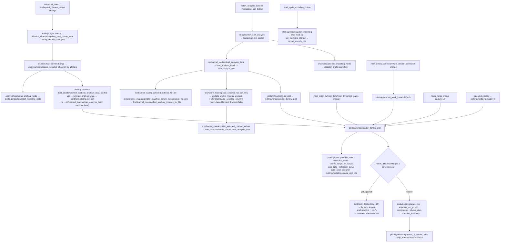
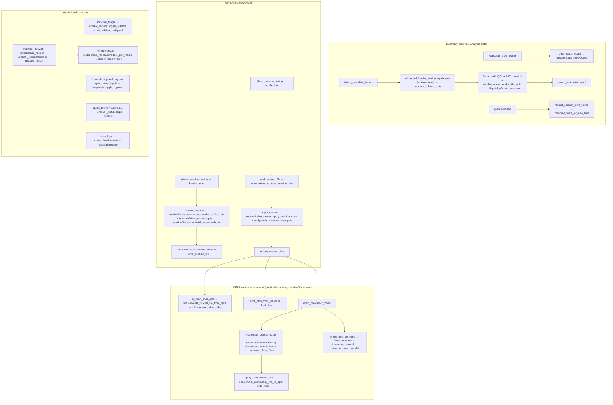

# PhaseFinder Function Call And User Decision Graphs

These diagrams summarize the ES-module browser app loaded by `index.html`. They
focus on user-triggered flows, the direct cross-module imports those flows use,
and the single `window.PhaseFinder` debug hook. Function labels are written as
`module.function` so each call resolves to a real module. To stay readable the
call graph is split into focused subgraphs (boot, file load, metadata table,
channel/plot/DJF, stats, session/reconnect, layout).

## Function call graph — boot, file load, metadata table

```mermaid
%%{init: {"flowchart": {"nodeSpacing": 70, "rankSpacing": 110, "curve": "basis"}, "themeVariables": {"fontSize": "16px"}}}%%
flowchart TD
  subgraph boot["Bootstrap (main.js)"]
    B0["index.html: script type=module → js/main.js"]
    B0 --> B1["init_tooltips → init_app_bootstrap → init_plot_listeners<br/>→ init_analysis_listeners → init_stats → init_panel_resize → init_session"]
    B1 --> B2["assign window.PhaseFinder = { app, djf(getter), plot }"]
    B1 --> B3["init_session → setTimeout(session/core.try_autoload, 0)"]
  end

  subgraph fileload["File load (io/metadata_io.load_files)"]
    F0["#file_input change · #drop_zone/#collapsed_upload_target drop"] --> F1["io/metadata_io.load_files"]
    F1 --> F2["fcs/metadata_processing.read_fcs_header<br/>→ fcs/parser: parse_header, parse_fcs_header_from_segments"]
    F1 --> F3["state/app_state.file_map.set · data_structs/metadata_frame: make_frame/concat_frames<br/>→ state/app_state.set_file_table"]
    F1 --> F4["ui/table_render.link_existing_metadata_row_to_loaded_entry<br/>ui/metadata_wizard.apply_current_filename_metadata_template"]
    F1 --> F5["dispatch pf-files-loaded"]
    F1 --> F6["session/file_cache.register_loaded_files → copy_worker (OPFS)"]
    F1 --> F7["ui/table_support.sort_file_table/update_views → ui/table_render.render_file_table<br/>ui/status_channels.populate_channel_controls/update_start_button_state"]
    F1 --> F8["ui/metadata_wizard.schedule_metadata_wizard_after_file_load"]
    F1 --> F9["io/channel_loading.refresh_analysis_after_metadata_change / preload_analysis_rows_in_background (if a plot exists)"]
  end

  subgraph metatable["Metadata table + wizard (ui/*)"]
    M0["#file_table input/change/click"] --> M1["main.js.update_annotation → data_structs/table_state.sync_file_annotations"]
    M0 --> M2["ui/table_render.handle_table_change → data_structs/table_state (filters/selection)<br/>→ ui/table_support.notify_selection_changed → dispatch fcs-selection-change"]
    M0 --> M3["ui/table_render.handle_table_click → sort_state / open_filter_field → render_file_table"]
    M4["#metadata_parse_button + wizard controls"] --> M5["ui/metadata_wizard.open_metadata_wizard · render_metadata_split_steps<br/>· apply_metadata_wizard → apply_filename_metadata_columns · reset_filename_metadata_columns"]
    M6["#metadata_import_button/#metadata_import_input"] --> M7["io/metadata_io.parse_delimited_metadata · find_metadata_filename_column<br/>· import_metadata_records → data_structs/metadata_frame.build_metadata_frame_from_records"]
    M8["#metadata_export_button"] --> M9["io/metadata_io.metadata_table_tsv · metadata_export_columns · save_blob"]
    M2 --> F5
  end

  B2 -. exposes .-> M9
```

## Function call graph — channel, plot, and DJF modeling

## Function call graph — stats, session, reconnect, layout

## User decision tree

Each node lists the user-facing HTML element(s) first, then the module function(s)
or event(s) reached from that choice.

```mermaid
%%{init: {"flowchart": {"nodeSpacing": 85, "rankSpacing": 125, "curve": "basis"}, "themeVariables": {"fontSize": "17px"}}}%%
flowchart TD
  start["User opens PhaseFinder<br/>index.html → main.js init_*() bootstrap"]
  start --> load_choice{"Load a saved session or start from FCS files?"}

  load_choice -->|"Load session"| load["#load_session_button<br/>session/core: handle_load → parse_session_toml → apply_session → restore_session_files"]
  load --> reconnect_decision{"All session FCS files restored?"}
  reconnect_decision -->|"Yes (OPFS cache / dev fetch)"| files_loaded
  reconnect_decision -->|"Some missing"| reconnect["#reconnect_modal<br/>session/reconnect: reconnect_from_directory / reconnect_from_files → apply_reconnected_files"]
  reconnect --> files_loaded

  load_choice -->|"Start from files"| dz["#drop_zone / #collapsed_upload_target / #file_input<br/>io/metadata_io.load_files → fcs/metadata_processing.read_fcs_header"]
  dz --> files_loaded["Files loaded<br/>render_file_table · populate_channel_controls · dispatch pf-files-loaded"]

  files_loaded --> metadata_decision{"Configure metadata?"}
  metadata_decision -->|"Split filenames"| mw["#metadata_parse_button + wizard<br/>ui/metadata_wizard.open_metadata_wizard → apply_metadata_wizard"]
  metadata_decision -->|"Add blank column"| addcol["#metadata_add_column_button<br/>data_structs/metadata_columns.add_manual_metadata_column"]
  metadata_decision -->|"Import table"| imp["#metadata_import_button<br/>io/metadata_io.import_metadata_records"]
  metadata_decision -->|"Export table"| exp["#metadata_export_button<br/>io/metadata_io.metadata_table_tsv → save_blob"]
  metadata_decision -->|"Edit / filter / sort / select rows"| tbl["#file_table controls<br/>main.js.update_annotation · ui/table_render.handle_table_change/handle_table_click"]
  mw --> tbl
  addcol --> tbl
  imp --> tbl
  exp --> tbl

  tbl --> channel_decision{"Choose DNA-content channel?"}
  channel_decision -->|"Select channel"| ch["#channel_select / #collapsed_channel_select<br/>ui/status_channels.update_start_button_state · main.js.notify_channel_changed → fcs-channel-change<br/>→ analysis/start.prepare_selected_channel_for_plotting"]
  ch --> plot_decision{"Plot channel events?"}
  plot_decision -->|"Plot"| plot["#start_analysis_button / #collapsed_plot_button<br/>analysis/start.start_analysis → io/channel_loading.load_analysis_data (module worker)<br/>→ plotting/modeling.init_plot → plotting/render.render_density_plot (d3)"]

  plot --> adjust_decision{"Adjust plot or run modeling?"}
  adjust_decision -->|"Display: color / bins / thresh"| disp["#plot_color_by · #plot_bins · #plot_threshold_toggle<br/>plotting/render.render_density_plot"]
  adjust_decision -->|"Corrections: debris / doublets"| corr["#plot_debris_correction · #plot_doublet_correction<br/>set_peak_threshold(null) → render (lazy-loads DJF via djf_loader)"]
  adjust_decision -->|"Axis limits"| axis["#axis_range_modal<br/>plotting/axis_modal.apply_axis_range_modal → render_density_plot"]
  adjust_decision -->|"Run modeling"| model["#cell_cycle_modeling_button<br/>plotting/modeling.start_modeling → await plotting/djf_loader.load_djf()<br/>→ analysis/djf: fit / components / phase_stats → fit-results table"]
  disp --> adjust_decision
  corr --> adjust_decision
  axis --> adjust_decision
  model --> fit_choice{"Show / hide sample fits?"}
  fit_choice -->|"Legend checkbox"| fittoggle["SVG legend row<br/>plotting/modeling.toggle_fit → render_density_plot"]
  fit_choice -->|"Continue"| stats_decision
  adjust_decision -->|"Skip modeling"| stats_decision
  fittoggle --> stats_decision

  stats_decision{"Calculate summary statistics?"}
  stats_decision -->|"Open stats modal"| stats["#calculate_stats_button<br/>analysis/stats.open_stats_modal → run_stats_calculation<br/>→ compute_column_stats → render_file_table → pf-stats-complete"]
  stats_decision -->|"Skip"| session_decision
  stats --> session_decision

  session_decision{"Save a session?"}
  session_decision -->|"Save"| save["#save_session_button<br/>session/core.handle_save → collect_session → serialize_session → write_session_file"]
  session_decision -->|"No"| layout_decision
  save --> layout_decision

  layout_decision{"Adjust layout / help / restart?"}
  layout_decision -->|"Collapse / resize panels"| lay["#sidebar_toggle · #metadata_panel_toggle · #plot_panel_toggle · resizers<br/>ui/table_support · ui/panels · ui/panel_resize"]
  layout_decision -->|"Help"| help["status-bar help link → help.html"]
  layout_decision -->|"Restart"| restart["#site_logo → main.js.hard_restart → location.reload()"]
  lay --> tbl
```

## Source inventory (current module layout)

Entry and shared state:

- `js/main.js` — ES-module entry: top-level event wiring, `init_*()` bootstrap, and the `window.PhaseFinder = { app, djf, plot }` hook.
- `js/state/app_state.js` — `file_map` + `file_table_frame` behind accessors; `js/state/files.js` — file-selection queries.
- `js/ui/dom.js` — shared DOM references; `js/util/html.js`, `js/util/names.js` — leaf string helpers.

Core / domain (pure):

- `js/fcs/parser.js` — FCS HEADER/TEXT/DATA parsing (`FCSParser` export); `js/fcs/channel_cleaning.js` — normalization + H/W-companion matching + invalid-event filter.
- `js/io/parameter_map.js` — parameter-index resolution; `js/data_structs/metadata_frame.js`, `metadata_columns.js`, `table_state.js`, `channel_cache.js` — table model + state + cache.
- `js/session/toml_io.js` — session TOML serialize/parse; `js/analysis/djf.js` — Dean-Jett-Fox model (lazy-loaded, imports the ml-\* libraries).

IO / adapters (browser APIs, workers):

- `js/fcs/metadata_processing.js`, `js/io/metadata_io.js`, `js/io/channel_loading.js` — FCS metadata + selected-DATA loading; `js/fcs/data_worker.js` — selected-column module worker.
- `js/session/opfs_fs.js` — OPFS filesystem wrapper; `js/session/file_cache.js` — file registry + background cache; `js/session/copy_worker.js` — OPFS write module worker; `js/session/reconnect.js` — OPFS restore + reconnect matching.
- `js/plotting/djf_loader.js` — memoized dynamic-import loader for the DJF stack.

UI / plotting / analysis / session orchestration:

- `js/ui/status_channels.js`, `table_render.js`, `table_support.js`, `metadata_wizard.js`, `panels.js`, `panel_resize.js`, `hover_text.js` — table, status/channel controls, wizard, panels, tooltips.
- `js/plotting/data.js`, `render.js`, `modeling.js`, `axis_modal.js` — plot state/prep, D3 render, modeling UI + fit table, axis modal + `window.PhaseFinder.plot`.
- `js/analysis/start.js`, `stats.js` — plot/modeling orchestration and the statistics workflow; `js/session/table_session.js` (session↔table bridge) and `js/session/core.js` (save/load/restore orchestration + `init_session`).
