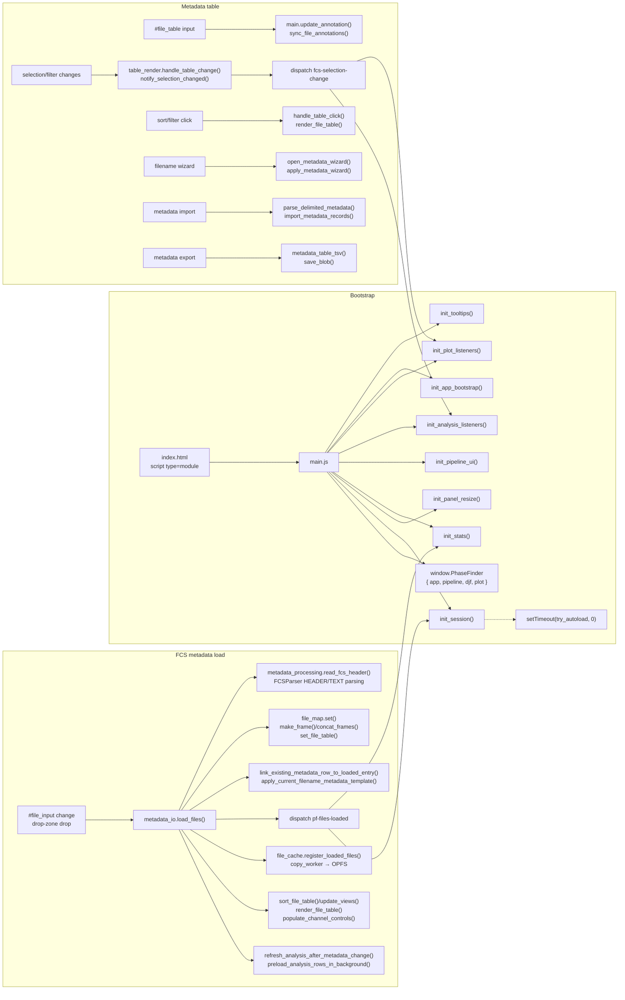
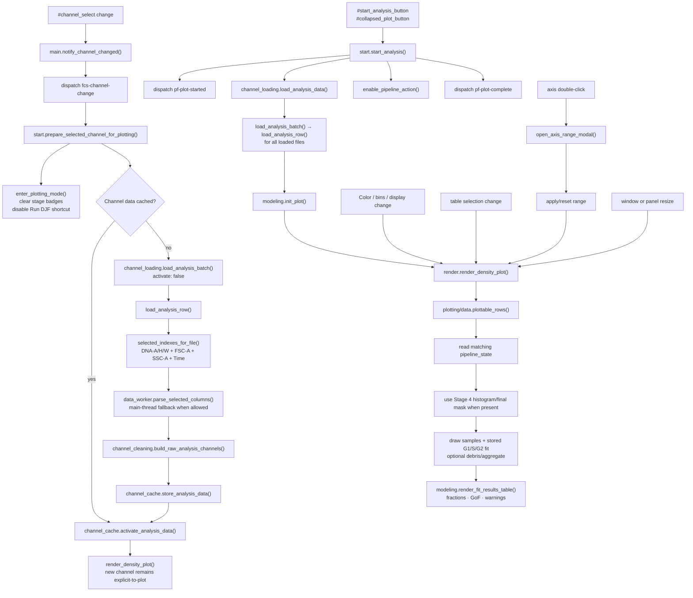
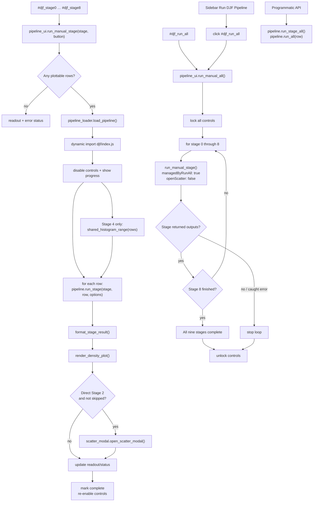
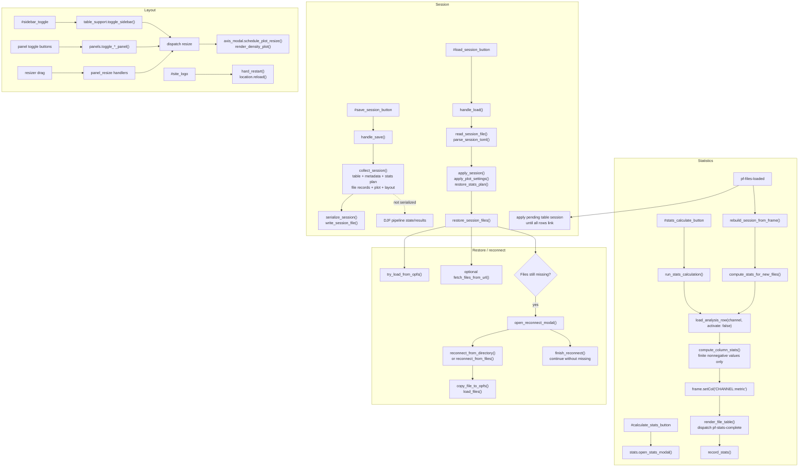
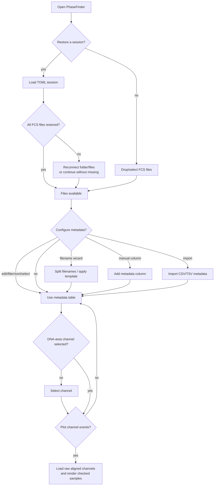
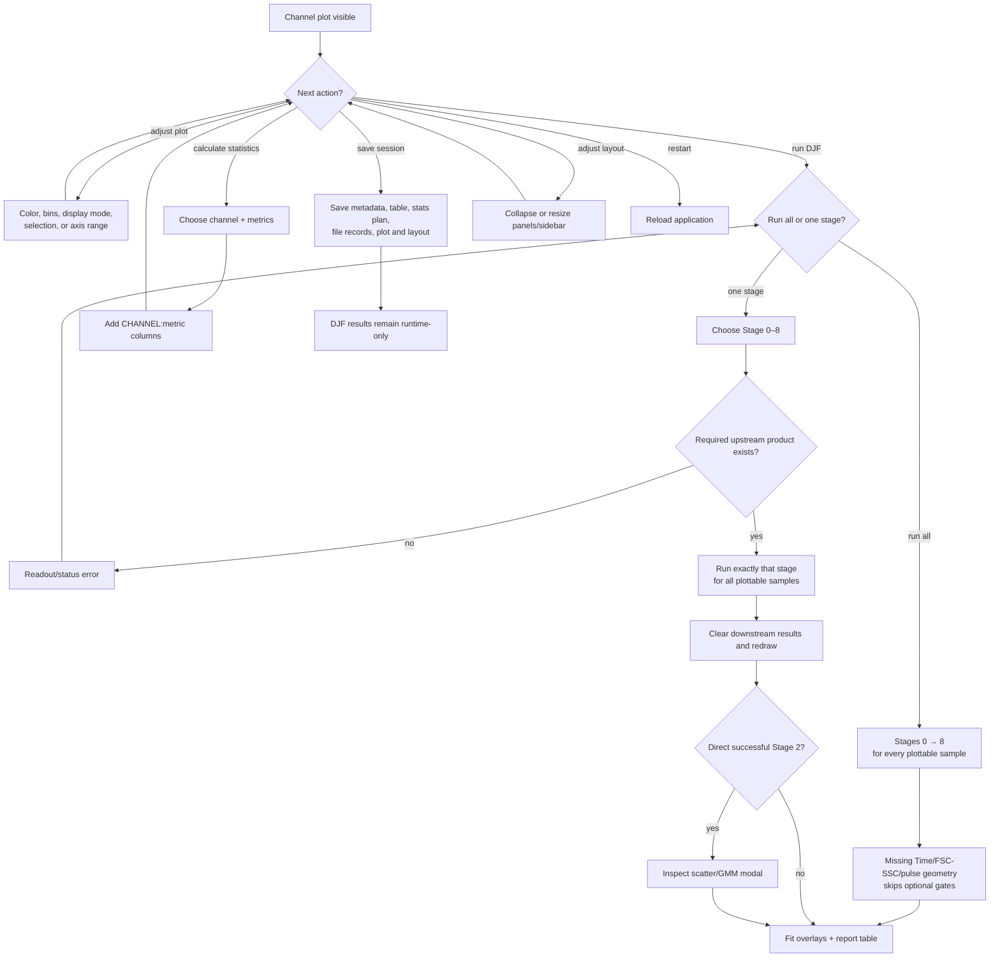

# PhaseFinder Function Calls And User Decisions

These graphs map user-facing controls to concrete module functions in the
current staged-pipeline application. They intentionally separate setup,
channel/plot loading, DJF orchestration, numerical stages, state invalidation,
and session/statistics flows so function names remain readable.

Important distinctions reflected below:

- The UI **Run all** path loops through `pipeline_ui.run_manual_stage()`; it does
  not call the programmatic `index.run_all(row)` helper.
- Stage 1–3 skip paths store null optional masks, preserving upstream masks.
- Stage 5 peak detection is diagnostic. Stage 6 consumes the Stage 4 histogram
  directly and can continue after `found: false`.
- Every stage rerun invalidates downstream products before the plot redraws.
- Pipeline results are runtime-only and are not serialized in session files.

## 1. Bootstrap, file load, and metadata calls

## 2. Channel selection, event loading, and plotting calls

Changing a channel preloads/activates its cache but intentionally leaves the
plot switch explicit. Clicking Plot Channel Events loads every file so unchecked
samples can be added later without another DATA read; only checked rows render.

## 3. Manual DJF pipeline UI calls

## 4. Stage-by-stage numerical calls

```mermaid
flowchart TD
  S0["index.run_stage0()"] --> S0A["stage0.runStructuralQC()<br/>createStructuralValidityMask()"]
  S0A --> S0B["set_stage_mask(0, structuralMask)"]

  S0B --> S1Q{"Time channel present?"}
  S1Q -- "no" --> S1S["Stage 1 skipped<br/>timeQC mask = null"]
  S1Q -- "yes" --> S1A["stage1.runTimeQC()<br/>prepareTimeQCBins()<br/>summarize + robust-score bins<br/>createTimeQCMask()"]
  S1S --> S2Q
  S1A --> S2Q

  S2Q{"FSC-A and SSC-A present?"}
  S2Q -- "no" --> S2S["Stage 2 skipped<br/>scatter mask = null"]
  S2Q -- "yes" --> S2A["stage2.gateMainBiologicalCloud()<br/>buildScatterPoints() → fitGMM2D()<br/>chooseMainBiologicalComponent()<br/>createScatterGateMask()"]
  S2S --> S3Q
  S2A --> S3Q

  S3Q{"DNA-H or DNA-W<br/>and enough usable events?"}
  S3Q -- "no" --> S3S["Stage 3 skipped<br/>singlet mask = null"]
  S3Q -- "yes" --> S3A["stage3.gateByPulseGeometry()<br/>select/build geometry points<br/>fitRobustRidge2D()<br/>createSingletMaskFromRidge()"]
  S3S --> S4
  S3A --> S4

  S4["index.run_stage4()<br/>recompute_final_mask()<br/>stage4.generateHistogram()"] --> S5
  S5["index.run_stage5()<br/>detectDNAContentPeaks()<br/>smooth + prominence + ratio score"] --> S5Q{"Valid pair found?"}
  S5Q -- "no" --> S5N["store found:false<br/>Run all may continue"]
  S5Q -- "yes" --> S5Y["store peak diagnostics"]
  S5N --> S6
  S5Y --> S6

  S6["index.run_stage6()<br/>fitCellCycleHistogram()<br/>initializeParameters()<br/>runLevenbergMarquardt()"] --> S7
  S7["index.run_stage7()<br/>extendCellCycleFit()<br/>inspectResidualStructure()"] --> S7Q{"Contamination signal?"}
  S7Q -- "none / weak improvement" --> S7B["chooseModel(): base"]
  S7Q -- "detected" --> S7E["fitCandidateModel()<br/>debris / aggregate / both<br/>compare SSE + BIC + targeted residuals"]
  S7B --> S8
  S7E --> S8
  S8["index.run_stage8()<br/>summarizeCellCycleFit()<br/>integrate components<br/>fractions + contamination + GoF<br/>residual checks + warnings<br/>createDisplaySummary()"]
```

## 5. Pipeline state, masks, and invalidation calls

```mermaid
flowchart LR
  T0["Any run_stageN(row)"] --> T1["pipeline_state.get_or_create_state(row)"]
  T1 --> T2{"Same rowId,<br/>channelKey, eventCount?"}
  T2 -- "no" --> T3["empty_state(row)<br/>replace filename-keyed Map entry"]
  T2 -- "yes" --> T4["reuse current state"]
  T3 --> T5["write Stage N product"]
  T4 --> T5

  T5 --> T6{"Stage 0–3?"}
  T6 -- "yes" --> T7["set_stage_mask(row, N, mask or null)"]
  T7 --> T8["recompute_final_mask()<br/>AND every non-null mask"]
  T6 -- "no" --> T9["retain current final mask"]
  T8 --> T10["invalidate_after(row, state, N)"]
  T9 --> T10

  T10 --> T11["clear state products N+1 … 8"]
  T10 --> T12["clear downstream masks when applicable"]
  T12 --> T8
  T10 --> T13["state.lastStageRun = N"]
  T13 --> T14["render_density_plot()"]

  C0["Different row.data.channel_key"] --> C1["enter_plotting_mode()<br/>clear completion badges"]
  C1 --> C2["render.active_pipeline_state()<br/>reject mismatched old state"]
  C2 --> T1

  T14 --> V0["Stage 4 histogram replaces display bins"]
  T14 --> V1["Stage 6/7 overlays stored curves"]
  T14 --> V2["Stage 8 populates report table"]
```

## 6. Statistics, sessions, reconnect, and layout calls

## 7. User decision tree — setup

## 8. User decision tree — analysis

## Source inventory

Entry and shared state:

- `js/main.js` — ES-module entry, listener bootstrap, and
  `window.PhaseFinder = { app, pipeline, djf, plot }`.
- `js/state/app_state.js`, `js/state/files.js` — loaded-file/frame ownership and
  selection queries.
- `js/data_structs/metadata_frame.js`, `metadata_columns.js`, `table_state.js`,
  `channel_cache.js` — table model, metadata state, and per-channel DATA caches.

FCS and IO:

- `js/fcs/parser.js` — FCS HEADER/TEXT/DATA parsing;
  `js/fcs/metadata_processing.js` — metadata-only header reads;
  `js/fcs/data_worker.js` — selected-column module worker.
- `js/fcs/channel_cleaning.js` — A/H/W/scatter/Time discovery and construction
  of aligned raw arrays, PnR values, and parameter metadata.
- `js/io/metadata_io.js`, `js/io/channel_loading.js`, `js/io/parameter_map.js` —
  file/table IO and selected-channel loading.

Staged DJF pipeline:

- `js/analysis/djf/pipeline_loader.js`, `pipeline_ui.js`, `pipeline_state.js`,
  `index.js`, `scatter_modal.js` — lazy loading, manual controls, state/masks,
  orchestration, and Stage 2 inspection.
- `stage0_structural.js` through `stage8_report.js` — the nine checkpoints;
  `stage_background.js` — explicit unspecified-background stub.
- `djf_components.js` and `math/{stats,gaussian,linalg2d,lm_solver,integrate}.js`
  — shared numerical implementation.

Rendering, analysis, and persistence:

- `js/plotting/data.js`, `render.js`, `modeling.js`, `axis_modal.js` — D3 plot
  state/rendering, staged fit/report presentation, and axis/inspection API.
- `js/analysis/start.js`, `stats.js` — channel/plot workflow and summary stats.
- `js/session/core.js`, `table_session.js`, `file_cache.js`, `reconnect.js`,
  `opfs_fs.js`, `copy_worker.js`, `toml_io.js` — session serialization, OPFS
  caching, and reconnect orchestration.
